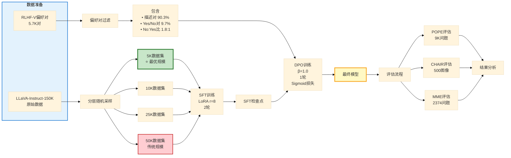
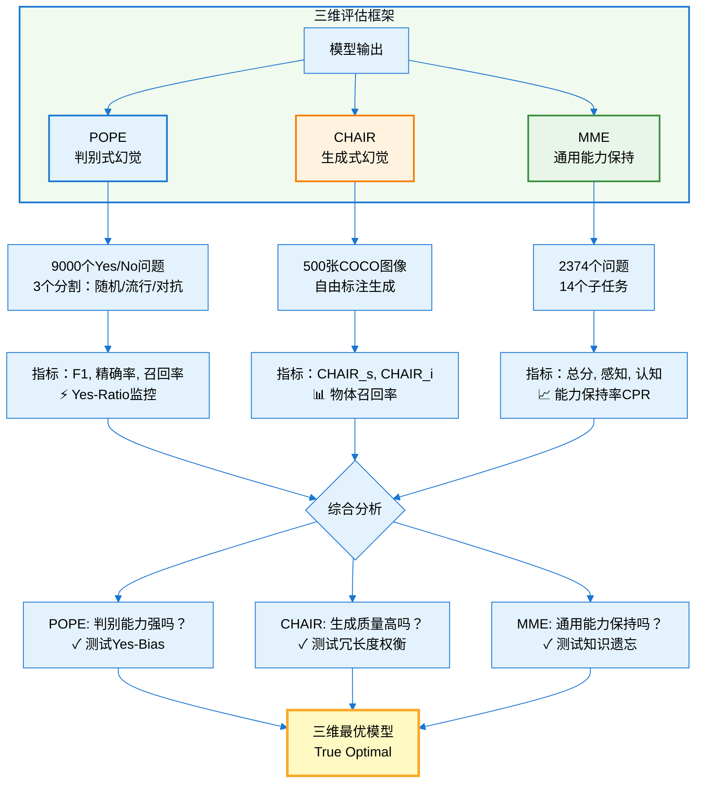

# 第3章 研究方法

## 3.1 基础模型：Qwen3-VL-8B-Instruct

我们选择Qwen3-VL-8B-Instruct作为基础模型。该模型拥有7.62B参数（包含视觉编码器为8.0B），采用Qwen2语言模型与基于ViT的视觉编码器架构，支持32K上下文长度。模型在1.5T多模态token上预训练，并在多样化的视觉问答任务上进行了指令调优，采用Apache 2.0完全开源协议。

选择这一模型基于四个考虑。首先是强大的基线性能，POPE准确率达到87.1%，与LLaVA-1.5相当。其次，8B规模适合快速消融实验，在单个A100-40GB上可以高效训练。第三，模型支持优秀的多语言能力（英文+中文）。最后，HuggingFace Transformers提供了完善的API文档。模型路径位于`../downloads/models/Qwen3-VL-8B-Instruct`。

## 3.2 监督微调阶段

### 3.2.1 训练数据

我们使用LLaVA-Instruct-150K数据集，为主实验筛选至50K样本。数据源自HuggingFace的`liuhaotian/LLaVA-Instruct-150K`，格式为(图像, 问题, 详细答案)三元组。数据组成中，90.3%为描述性问题（"详细描述这张图片"），9.7%为yes/no问题（"图中有狗吗？"）。我们过滤了低质量和重复样本，保留高多样性示例。

为研究数据规模效应，我们构建了四个数据集变体：5K、10K、25K和50K。数据文件路径为`data/llava_instruct_150k.json`。

### 3.2.2 LoRA配置

采用低秩适应（LoRA）实现参数高效微调。基线配置中，LoRA秩r=8，在容量与效率间达到平衡；LoRA alpha α=16，遵循标准缩放因子α=2r的惯例；目标模块覆盖所有线性层，实现全面适应；可训练参数为22M，仅占总参数的0.29%，体现高度参数效率。

消融研究测试了r ∈ {4, 8, 16, 32}以研究秩敏感性。不同秩对应的可训练参数分别为：r=4时11M、r=8时22M（基线）、r=16时44M、r=32时87M。

### 3.2.3 训练超参数

学习率设为5e-5，这是LoRA SFT的标准值。每设备批大小为16，梯度累积步数为2，有效批大小为32。训练2个epoch以防止过拟合。优化器使用AdamW（β1=0.9, β2=0.999），学习率调度采用余弦退火，预热比例为0.03。混合精度使用BF16加速训练，每样本最大长度为2048个token。

训练时间随数据规模变化显著。5K数据在A100-40GB上仅需约30分钟，而50K数据需要约5小时。配置文件位于`configs/qwen3vl_sft_*.yaml`（8个变体）。

## 3.3 直接偏好优化阶段

### 3.3.1 偏好数据

我们使用RLHF-V数据集，包含5,733个偏好对。数据源自HuggingFace的`HaoyeZhang/RLHF-V-Dataset`，格式为(图像, 提示词, 偏好回答, 拒绝回答)的二元偏好对，由人类标注并验证高一致性。

数据组成分析显示，90.3%为描述性回答（详细描述），9.7%为yes/no回答。在yes/no子集中，yes:no比例为290:525，呈现1.8:1的no-bias倾向。这意味着DPO训练会自然学习到保守行为。数据文件路径为`data/rlhf_v_5733.json`。

### 3.3.2 DPO超参数

Beta（β）是核心超参数，基线值为0.1，消融范围为{0.01, 0.05, 0.1, 0.2, 0.5, 1.0}。损失函数基线使用Sigmoid，测试了{Sigmoid, Hinge, IPO}三种变体。训练轮数基线为3（后续发现1轮更优），消融范围为{1, 3}。

其他配置包括：学习率5e-6（低于SFT以保持稳定），批大小8（更小以提高稳定性），梯度累积4（有效批大小32）。单轮训练约30分钟，3轮约90分钟。

Beta参数的物理意义是：β → 0时退化为最大似然估计（忽略偏好），β → ∞时KL约束占主导（紧贴参考策略）。最优β在偏好学习与稳定性间取得平衡。

### 3.3.3 训练流程

标准顺序训练遵循Base → SFT → DPO的流程。具体步骤为：加载基础Qwen3-VL-8B-Instruct模型，在LLaVA-150K上应用LoRA SFT，保存SFT适配器，加载SFT适配器并在RLHF-V上应用DPO，最终保存包含合并SFT+DPO权重的DPO适配器。

为测试SFT的必要性，我们还训练了DPO-only变体（Base → DPO，跳过SFT）。配置文件位于`configs/qwen3vl_dpo_*.yaml`（20个变体）。

**图3.3：数据处理流程**

**图3.3说明**：从原始数据到最终评估的完整流程。左侧数据准备：LLaVA-150K分层采样生成4个规模数据集（5K⭐最优），RLHF-V过滤后包含90.3%描述对。中间训练：SFT生成检查点，DPO结合检查点生成最终模型。右侧评估：三基准（POPE/CHAIR/MME）联合评估。流程突出5K数据集（绿色）和最终模型（黄色），50K标红示次优。

## 3.4 消融研究设计

我们在5个正交维度上进行系统消融，共评估20个模型配置。

**LoRA秩消融**（4个配置）。变量为LoRA秩r ∈ {4, 8, 16, 32}，固定SFT 50K数据训练2轮、DPO β=0.1训练3轮。目标是确定幻觉缓解的最小秩需求。

**SFT数据规模消融**（4个配置）。变量为数据量∈ {5K, 10K, 25K, 50K}，固定LoRA r=8、DPO β=0.1。目标是测试"更多数据→更少幻觉"的假设。训练时间从5K的0.5小时到50K的5小时，呈现10倍差异。

**DPO Beta消融**（6个配置）。变量为β ∈ {0.01, 0.05, 0.1, 0.2, 0.5, 1.0}，固定SFT 50K、LoRA r=8、DPO 3轮、sigmoid损失。目标是找到最优KL约束强度。假设是更高的β带来更强的yes-bias修正。

**损失函数消融**（3个配置）。变量为损失函数∈ {Sigmoid, Hinge, IPO}，固定SFT 50K、LoRA r=8、DPO β=0.1训练3轮。三种损失函数定义为：Sigmoid的L = -log σ(β(r_w - r_l))，Hinge的L = max(0, 1 - β(r_w - r_l))，IPO的L = (r_w - r_l - 1/2β)²。目标是比较DPO变体在VLM幻觉缓解中的表现。

**训练阶段消融**（3个配置）。变体包括：SFT-only（Base → SFT，无DPO）、DPO-only（Base → DPO，无SFT）、SFT+DPO（Base → SFT → DPO，完整流程）。目标是确定每个阶段的必要性。

**True Optimal配置**。这是结合所有消融最优超参数的配置：SFT使用5K数据（来自数据规模消融），DPO使用β=1.0单轮训练（来自beta与轮数消融），LoRA保持r=8（秩消融显示足够）。假设该配置在所有指标上达到全局最优。

总计配置数为4 + 4 + 6 + 3 + 3 + 1 = 21个模型，去重后为20个模型。

## 3.5 评估协议

### 3.5.1 POPE评估

POPE（Polling-based Object Probing Evaluation）测试判别式幻觉。基准包含9,000个yes/no问题，分为三个难度分割，每个3,000题。随机分割从COCO词汇表随机采样物体，流行分割聚焦高频物体（person、car、tree），对抗分割测试共现物体（chair + table、fork + knife）。

评估指标包括准确率（整体正确率）、精确率（正向预测值）、召回率（灵敏度）、F1（精确率与召回率的调和平均）、Yes-Ratio（"yes"预测占比，偏差指标）。真值来自COCO物体标注。评估脚本为`eval/generate_pope_answers.py`和`eval/eval_pope.py`。

### 3.5.2 CHAIR评估

CHAIR（Caption Hallucination Assessment with Image Relevance）测试生成式幻觉。使用COCO val2014的500张图像，任务是生成详细图像描述。评估指标包括CHAIR_s（句子级幻觉率，含≥1个幻觉的描述占比）、CHAIR_i（实例级幻觉率，幻觉物体占比）、召回率（真实物体覆盖率）、物体数量（详细度指标）。

真值为COCO的80个物体类别。评估脚本为`eval/generate_chair_captions.py`和`eval/eval_chair.py`。

### 3.5.3 MME评估

MME（Multimodal Evaluation）测试能力保持。基准包含1,187张图像上的2,374个yes/no问题，涵盖14个子任务，分为两类。感知任务（10个）包括存在性、计数、位置、颜色、海报、名人、场景、地标、艺术品、OCR。认知任务（4个）包括常识推理、数值计算、文本翻译、代码推理。

评分系统基于准确率（per-question正确率）、准确率+（配对问题均正确）和得分（(acc + acc+) × 图像数，最高2800）。指标分为感知分数（最高2000）、认知分数（最高800）、总分（最高2800）。真值为人工标注的yes/no标签。评估脚本为`eval/generate_mme_answers.py`和`eval/eval_mme.py`。

**图3.2：评估基准三维框架**

**图3.2说明**：POPE测试判别能力和Yes-Bias，CHAIR测试生成质量，MME测试能力保持，三者互补形成完整评估体系，防止单一基准的片面结论（如DPO-only悖论：POPE优秀但CHAIR糟糕）。

## 3.6 基础设施

硬件配置为4×NVIDIA A100-40GB GPU（共享服务器）、64核AMD EPYC CPU、512GB内存。软件环境包括LLaMA-Factory 0.9.1训练框架、DeepSpeed ZeRO-2分布式训练、vLLM 0.6.0推理加速、Python 3.12.0、PyTorch 2.5.0、CUDA 12.4。

LLaMA-Factory提供了统一的SFT/DPO训练流程，支持LoRA并自动合并适配器，基于YAML配置（28个配置文件）。为确保可复现性，所有配置位于`configs/`目录，随机种子固定为42，启用确定性CUDA操作。

总结实验设置：基础模型为Qwen3-VL-8B-Instruct，SFT阶段使用50K LLaVA数据和LoRA r=8，DPO阶段使用5.7K RLHF-V数据和β=0.1，消融研究涵盖5个维度共20个配置，评估采用POPE + CHAIR + MME三维策略，总训练时间约100 GPU小时。
