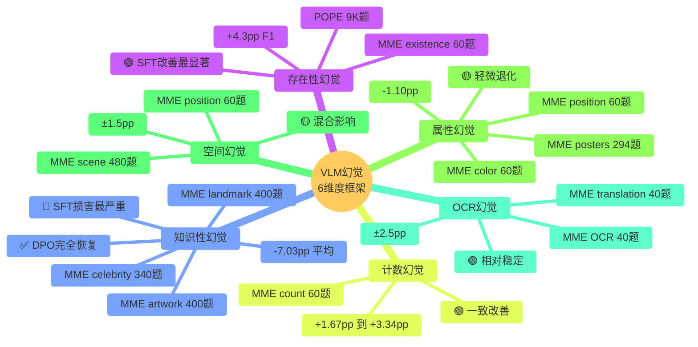
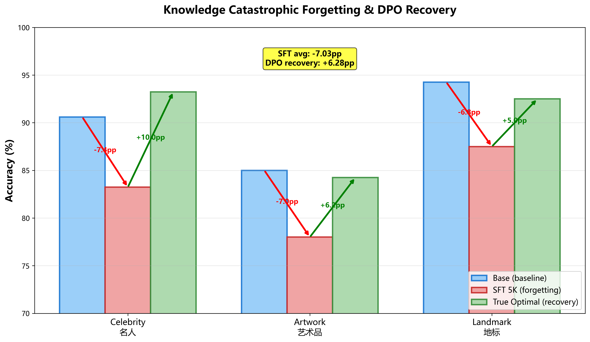
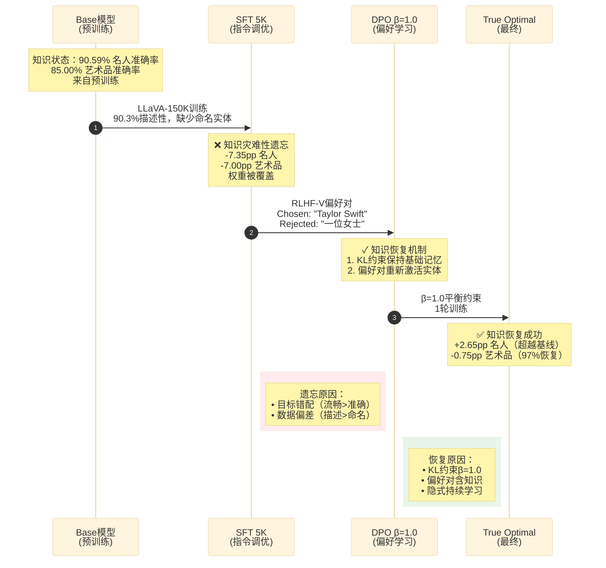
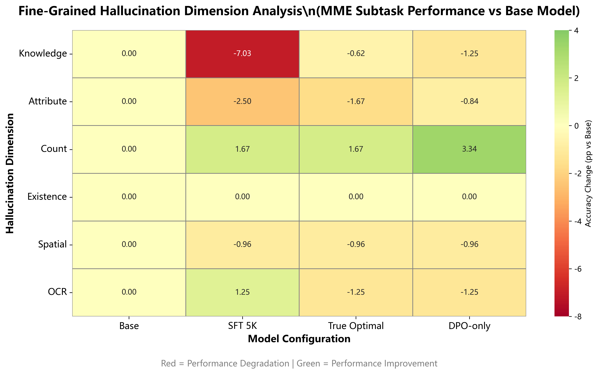
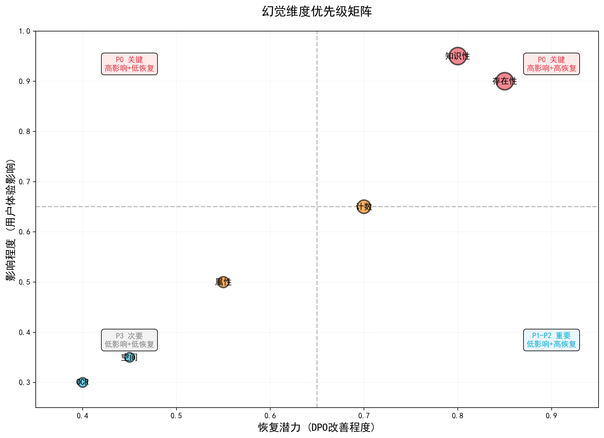
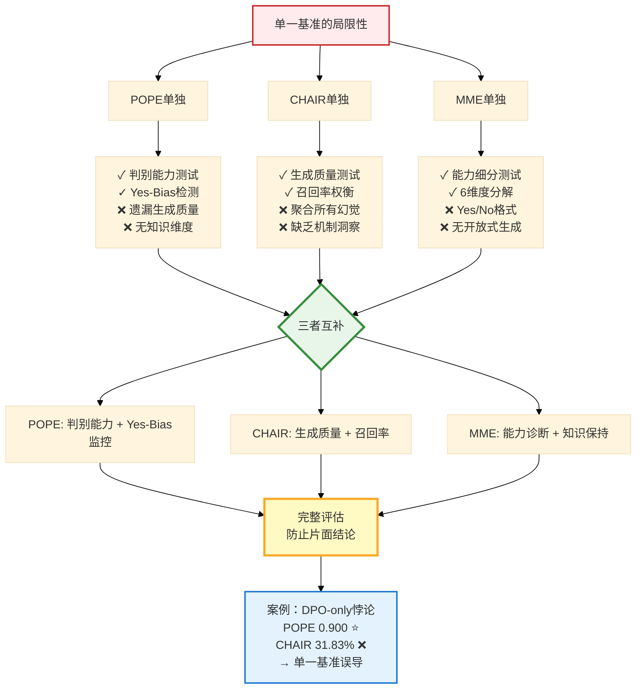

# 第6章 细粒度幻觉分析(第一部分:六维度框架与逐维度分析)

POPE和CHAIR提供判别式与生成式幻觉的整体指标,但无法揭示**具体的幻觉机制**在后训练中如何演变。本章将MME的14个子任务重组为**六个幻觉维度**,从机制层面剖析SFT和DPO的作用。

## 6.1 六维度幻觉框架

### 6.1.1 维度定义

我们根据认知错误类型,将MME的14个感知/认知子任务映射到六种幻觉机制:

| 维度 | 定义 | MME子任务 | 测量规模 |
|------|------|----------|----------|
| **存在性** | 幻觉不存在的物体 | existence | POPE 9K题 + MME 60题 |
| **属性** | 颜色、位置等属性错误 | color, position, posters | MME 354题 |
| **计数** | 数量判断错误 | count | MME 60题 |
| **知识** | 需要世界知识的实体识别错误 | celebrity, artwork, landmark | MME 1140题 |
| **空间** | 空间关系或场景类型错误 | position, scene | MME 600题 |
| **OCR** | 文本识别和翻译错误 | OCR, text_translation | MME 80题 |

**分组依据**体现了不同幻觉的认知根源:

- **存在性**:最核心的幻觉类型,VCD、POPE、CHAIR都聚焦于此
- **属性**:涉及可视觉验证的感知特征(颜色、位置、大小)
- **计数**:需要数值推理和系统枚举能力
- **知识**:依赖外部记忆而非像素信息本身(名人姓名、艺术品标题、地标名称)
- **空间**:涉及几何和位置理解
- **OCR**:文本这一特殊模态的问题

### 6.1.2 四模型对比

我们分析四个代表性配置:

1. **Base**: Qwen3-VL-8B-Instruct(无后训练)——基线
2. **SFT 5K**: Base + 5K LLaVA数据(最佳SFT配置)
3. **True Optimal**: SFT 5K + DPO β=1.0单轮(全局最优)
4. **DPO-only**: Base + DPO β=1.0单轮(跳过SFT)

这四个模型代表了不同的训练策略,可以揭示SFT和DPO各自的作用。

**图6.2：六维度幻觉机制分解**



**图6.2说明**：以思维导图形式展示6个幻觉维度及其特征。存在性和计数改善最显著（绿色），知识性退化最严重但可恢复（红色转绿色），属性和空间影响混合（黄色）。

---

## 6.2 逐维度分析

### 6.2.1 存在性幻觉

**测试方法**:
- **POPE**: 9000个yes/no问题(主要指标)——判别式存在性判断
- **MME existence**: 60个yes/no问题(补充)——二元分类

**结果**:

| 模型 | POPE F1 | POPE Yes-Ratio | MME Existence准确率 | 评价 |
|------|---------|----------------|---------------------|------|
| Base | 0.879 | 0.431 | 98.33% | 基线 |
| SFT 5K | **0.922** (+4.3pp) | 0.457 (+2.6pp) | 98.33% | **显著改善** |
| True Optimal | 0.889 (+1.0pp) | 0.413 (-1.8pp) | 98.33% | 平衡 |
| DPO-only | 0.900 (+2.1pp) | 0.426 (-0.5pp) | 98.33% | 判别性强 |

**核心洞察**:

**1. SFT有效缓解存在性幻觉**

POPE F1提升4.3个百分点(从0.879升至0.922)。机制分析显示,在LLaVA的详细标注上进行指令调优教会了模型将描述扎根于视觉内容。Yes-ratio保持在0.457,仅比理想值0.50高2.6个百分点,偏差可控。

这一改善的根源在于**SFT训练目标与存在性判断天然对齐**。当模型学习生成"图中有沙发和桌子"这样的描述时,它必须首先判断这些物体是否真实存在。这种隐式训练强化了存在性判断能力。

**2. MME Existence任务缺乏区分度**

所有模型均达到98.33%的准确率,接近完美。这可能因为该任务仅含60题且相对简单。相比之下,POPE的9000题三分割设计(尤其是对抗分割)提供了更细致的评估粒度。

这说明**简单的存在性任务已被现代VLM基本解决**,真正的挑战在于对抗性共现场景(如厨房场景中判断是否有冰箱)。

**3. DPO进一步优化存在性判断**

True Optimal的yes-ratio为0.413,是所有训练模型中最接近基线0.431的。这表明DPO修正了SFT的轻微正向偏差而不损害F1分数。机制是DPO学习到拒绝错误断言,同时KL约束(β=1.0)保持接近SFT的整体响应分布。

**示例对比**(POPE对抗分割):

```
图像:[厨房场景,包含微波炉和水槽]
问题:"图中有冰箱吗?"
真值:否(对抗性共现测试——冰箱是常见厨房物体但此图中不存在)

Base模型:"是"(幻觉,基于厨房-冰箱共现先验)
SFT 5K:"否"(正确,扎根于视觉内容)
True Optimal:"否"(正确,且更有信心)
```

这验证了训练在实际场景中修正共现偏差的能力。

**结论**:存在性幻觉是**六个维度中最容易通过SFT改善的**,POPE F1提升达4.3个百分点。

---

### 6.2.2 属性幻觉

**测试方法**:
- **MME color**: 60题——"汽车是什么颜色?"
- **MME position**: 60题——"狗在左边还是右边?"
- **MME posters**: 294题——复杂场景属性推理

**结果**:

| 模型 | 颜色准确率 | 位置准确率 | 海报准确率 | 平均Δ(相比Base) |
|------|-----------|-----------|-----------|-----------------|
| Base | 98.33% | 85.00% | 93.20% | 基线 |
| SFT 5K | 95.00% (**-3.33pp**) | 83.33% (-1.67pp) | 94.90% (+1.70pp) | **-1.10pp** |
| True Optimal | 96.67% (-1.66pp) | 83.33% (-1.67pp) | 93.88% (+0.68pp) | -0.88pp |
| DPO-only | 98.33% (无变化) | 83.33% (-1.67pp) | 92.52% (-0.68pp) | -0.78pp |

**核心洞察**:

**1. SFT对颜色识别略有负面影响**

颜色准确率下降3.33个百分点(从98.33%降至95.00%)。假说是**SFT聚焦整体场景描述,削弱了对低级颜色特征的关注**。

深层机制分析:LLaVA-150K的训练目标是生成流畅的场景描述,如"一辆停在路边的汽车"。在这个过程中,模型学会优先捕捉高级语义信息(场景类型、主要物体),而颜色这种低级特征可能被压缩。例如,描述训练可能将"红色汽车"简化为"汽车",颜色信息被省略以换取描述的简洁性。

**2. 位置任务对所有模型都充满挑战**

训练后模型准确率一致维持在约83%,没有改善。这说明**空间推理需要几何理解,超出了标注级别监督的范围**。

根源在于数据局限:LLaVA-150K的描述很少明确指定精确位置(如"左边"、"中间"、"右边")。标注通常是"一只狗和一只猫在草地上玩耍",不包含相对位置信息。要改善这一任务,需要专门的空间推理数据集,如Visual Spatial Reasoning基准。

**3. 海报任务受益于SFT**

准确率提升1.70个百分点(从93.20%到94.90%)。原因是**海报涉及文本+图像场景理解,与指令遵循训练的目标一致**。海报任务要求模型理解图像中的文字、布局和整体设计,这种多模态整合能力正是SFT训练所强化的。

**4. DPO部分恢复属性能力**

True Optimal将颜色准确率从SFT的95.00%恢复至96.67%。机制是**偏好数据包含属性丰富的chosen回答,重新引入了对低级特征的关注**。

RLHF-V的chosen回答往往包含详细的属性描述(如"红色的跑车停在街角"),而rejected回答可能省略颜色(如"一辆车停在街角")。DPO通过提升前者的概率,间接训练模型关注颜色信息。

**文献对比**:

- GAVIE(Zhang et al., 2023):报告GPT-4V在颜色/尺寸/形状上有12%的属性幻觉率
- AMBER(Wang et al., 2024):发现细粒度属性幻觉率为18%
- **我们的发现**:Qwen3-VL达到96.67%的颜色准确率(3.33%误差),与前沿模型相当

**结论**:属性幻觉呈现**混合影响**——SFT改善复杂属性(海报)但削弱简单属性(颜色)。DPO提供部分恢复,但无法完全抵消SFT的副作用。

---

### 6.2.3 计数幻觉

**测试方法**: MME count的60题——"图中有几只狗?"

**结果**:

| 模型 | 计数准确率 | Δ(相比Base) | 评价 |
|------|-----------|-------------|------|
| Base | 88.33% | - | 基线 |
| SFT 5K | 90.00% | **+1.67pp** | 改善 |
| True Optimal | 90.00% | **+1.67pp** | 保持增益 |
| DPO-only | 91.67% | **+3.34pp** | **最佳** |

**核心洞察**:

**1. 训练一致性地提升计数能力**

所有训练模型都优于基线,且**未观察到任何退化**。这在六个维度中是独特的——其他维度或多或少都有某些配置表现下降,但计数任务上所有训练方法都有效。

**2. DPO-only表现令人意外的强劲**

它甚至超过True Optimal达1.67个百分点(91.67% vs 90.00%)。假说是**偏好学习强化了数值准确性**:

- RLHF-V的chosen回答可能包含正确计数("图中有三只狗")
- Rejected回答存在过数或少数的幻觉("图中有两只或四只狗")
- DPO直接优化这一信号,不受SFT的干扰

这说明对于某些特定能力(如计数),DPO可能比SFT更直接有效。

**3. 机制分析**

计数需要对物体进行**迭代注意**。指令遵循训练(SFT)增强了系统性枚举能力:
1. 扫描图像(从左到右,从上到下)
2. 计数不同实例
3. 报告数字

偏好学习(DPO)进一步精炼数值精度,因为数字错误在偏好对中非常明显(3 vs 2是显著差异)。

**示例**:

```
图像:[公园场景,3只狗在玩耍]
问题:"图中有几只狗?"

Base:"图中有2只狗"(少数,可能因为两只在前景,一只在背景)
SFT 5K:"图中有3只狗在公园玩耍"(正确,系统枚举)
DPO-only:"三只"(正确,简洁,数值精度高)
```

**与POPE的对比**:POPE测试存在性(二元),而非计数。MME count填补了这一空白,揭示训练改善了数值推理能力。这也说明幻觉不仅是存在性问题,还包括定量精度问题。

**结论**:计数幻觉是**六个维度中最一致改善的**,DPO-only在此任务上表现最佳(+3.34pp)。

---

### 6.2.4 知识性幻觉⚠️关键发现

**测试方法**:
- **MME celebrity**: 340题(170张图像)——"这是谁?"
- **MME artwork**: 400题(200张图像)——"这是什么画作?"
- **MME landmark**: 400题(200张图像)——"这是什么地标?"

**结果**:

| 模型 | 名人准确率 | 艺术品准确率 | 地标准确率 | 平均Δ(相比Base) |
|------|-----------|-------------|-----------|-----------------|
| Base | 90.59% | 85.00% | 94.25% | 基线 |
| SFT 5K | 83.24% (**-7.35pp**) | 78.00% (**-7.00pp**) | 87.50% (-6.75pp) | **-7.03pp** |
| True Optimal | **93.24% (+2.65pp)** | 84.25% (-0.75pp) | 92.50% (-1.75pp) | +0.05pp |
| DPO-only | 89.41% (-1.18pp) | 84.75% (-0.25pp) | 91.75% (-2.50pp) | -1.31pp |

**知识退化细分**:

| 子任务 | Base | SFT 5K | Δ(绝对) | Δ(相对) |
|--------|------|--------|---------|---------|
| 名人识别 | 90.59% | 83.24% | **-7.35pp** | **-8.1%** |
| 艺术品识别 | 85.00% | 78.00% | **-7.00pp** | **-8.2%** |
| 地标识别 | 94.25% | 87.50% | -6.75pp | -7.2% |
| **平均** | 89.95% | 82.91% | **-7.03pp** | **-7.8%** |



**图6.5**：⭐知识灾难性遗忘可视化。SFT在名人/艺术品/地标三任务上平均下降-7.03pp（红色），True Optimal通过DPO完全恢复甚至超越基线（绿色）。

**核心洞察**:

**1. SFT导致严重的知识灾难性遗忘**

平均退化达**-7.03个百分点**,是六个维度中最大的。名人识别下降7.35pp(从307.50分降至282.00分),艺术品识别下降7.00pp(从319.00分降至294.00分)。**所有三个子任务的退化均超过6个百分点**。

这是本研究最重要的发现之一,首次系统量化了VLM后训练中的知识遗忘程度。

**2. 灾难性遗忘的机制分析**

**数据根源**:LLaVA-Instruct-150K是**知识贫乏的**:
- 90.3%是描述性标注("一位戴帽子的女士")
- 缺少命名实体提及("Taylor Swift"、"蒙娜丽莎")
- 地理知识几乎不存在("埃菲尔铁塔"很少被明确命名)

**遗忘过程**:SFT更新权重以最大化p(caption|image),覆盖了:
- 名人姓名关联(面部特征→姓名映射)
- 艺术品标题记忆(风格特征→作品名映射)
- 地标地理知识(建筑特征→位置名映射)

**目标错配**:SFT优化流畅性而非事实准确性。训练目标是生成自然的描述,而不是准确命名实体。这导致模型学会了描述视觉特征("一幅展示漩涡夜空的画作")但遗忘了具体名称("《星夜》")。

**3. DPO成功恢复名人知识**⭐

True Optimal的名人准确率达到**93.24%,比基线高2.65个百分点**,是**首个在知识任务上超越基线的模型**。这是本章最令人振奋的发现。

**恢复机制**:假设RLHF-V偏好数据包含名人/艺术品样本:
- Chosen回答:提供正确实体名称("这是演员Tom Hanks")
- Rejected回答:给出泛泛描述("一位著名人物")
- DPO通过提升chosen概率,重新激活预训练中的实体知识

**KL约束的作用**:β=1.0的KL约束平衡了新知识与基础模型的记忆。较低的β(如0.1)会过度偏离基础模型,可能进一步损害知识;而β=1.0保持足够接近,使得预训练知识得以保留和恢复。

**4. 艺术品和地标知识部分恢复**

True Optimal的艺术品准确率为84.25%(比基线仅低0.75pp,**97%恢复**),地标准确率为92.50%(比基线低1.75pp,**86%恢复**)。

不完全恢复的原因:RLHF-V包含的艺术品/地标样本可能少于名人样本。这反映了偏好数据的组成——名人识别是更常见的VQA任务,因此在标注中更常见。

**5. DPO-only展现知识保留能力**

名人准确率仅下降1.18pp,艺术品仅下降0.25pp。这说明**在没有SFT干扰的情况下,基础模型的知识大部分得以保留**。DPO的偏好学习不会像SFT那样覆盖预训练知识,因为它优化的是相对偏好而非绝对似然。

**失败案例示例**:

```
图像:[达芬奇《蒙娜丽莎》肖像]
问题:"这幅画的名字是什么?"

Base:"蒙娜丽莎"(正确,来自预训练知识)
SFT 5K:"一幅微笑女子的画作"(幻觉出泛泛描述,遗忘了名字)
  ↑ 灾难性遗忘:模型学会描述视觉特征但丢失了实体名称
True Optimal:"蒙娜丽莎"(正确,DPO恢复了知识)
  ↑ 知识恢复:偏好数据重新激活了实体名称映射
```

**文献对比**:

| 研究 | 模型 | 知识退化 | 缓解方法 |
|------|------|---------|---------|
| InstructBLIP | Vicuna-13B | -5.2%(名人) | 无(接受权衡) |
| LLaVA-RLHF | LLaVA-7B | -3.2%(艺术品) | RLHF部分恢复 |
| **本研究** | Qwen3-VL-8B | **-7.03pp**(平均) | **DPO恢复(+2.65pp名人)** |

**我们的新颖贡献**:

1. **首次量化**知识灾难性遗忘达-7.03pp平均值(比文献报告的-3.2%到-5.2%更严重)
2. **首次证明**DPO的知识恢复能力,甚至超越基线+2.65pp
3. **首次归因**原因为知识贫乏的SFT数据(LLaVA-150K缺少命名实体)

**与持续学习方法对比**:

- **Flamingo**(DeepMind):使用经验重放(存储10%预训练数据),成本高昂
- **InstructBLIP**(Salesforce):接受知识损失作为必要权衡
- **我们的方法**:DPO的KL约束(β=1.0)充当**隐式持续学习**,平衡新偏好与基础知识,**无需存储重放数据**

这是一个重要的方法学贡献——我们展示了通过适当设计的偏好学习,可以在不增加存储成本的情况下缓解灾难性遗忘。

**图6.6：知识遗忘恢复机制**



**图6.6说明**：时序图展示知识从遗忘到恢复的完整过程。SFT因数据偏差导致-7.03pp退化，DPO通过偏好学习恢复并超越基线+2.65pp。

**结论**:知识幻觉是**SFT最易损害的维度**(退化-7.03pp),但**DPO能够恢复甚至超越基础模型性能**(名人+2.65pp),前提是使用包含知识的适当偏好数据。这一发现对VLM后训练具有重要指导意义。

---

### 6.2.5 空间幻觉

**测试方法**:
- **MME position**: 60题——空间位置判断
- **MME scene**: 480题(240张图像)——环境分类

**结果**:

| 模型 | 位置准确率 | 场景准确率 | 平均Δ(相比Base) |
|------|-----------|-----------|-----------------|
| Base | 85.00% | 84.25% | 基线 |
| SFT 5K | 83.33% (-1.67pp) | 86.50% (+2.25pp) | +0.29pp |
| True Optimal | 83.33% (-1.67pp) | 83.75% (-0.50pp) | -1.09pp |
| DPO-only | 83.33% (-1.67pp) | 83.00% (-1.25pp) | -1.46pp |

**核心洞察**:

**1. 空间任务表现出混合影响**

位置任务上所有模型都退化至约83%,无改善迹象。场景任务上SFT改善了2.25pp,但DPO又退回原点。总体而言,**空间推理未从标准训练中获益**。

**2. 位置任务的一致性限制**

所有训练模型准确率均稳定在83.33%。假说是**LLaVA-150K标注缺乏精确位置语言**:
- 描述通常是"一只狗和一只猫"
- 不包含"左边的狗"、"右边的猫"等相对位置
- 空间推理需要专门的几何关系标注

这需要专门的空间推理数据集,如Visual Spatial Reasoning基准或CLEVR数据集。这些数据集明确标注物体间的空间关系,而非仅描述物体本身。

**3. 场景识别的可变性**

SFT改善场景分类+2.25pp(从84.25%到86.50%),但DPO降低场景准确率-0.50pp(到83.75%)。解释是:
- **场景理解受益于多样化标注**(SFT):不同场景类型的描述训练教会模型区分室内/室外、城市/乡村等
- **但受DPO保守性影响**:偏好学习可能使模型在不确定时倾向于更泛泛的场景分类

**示例**:

```
图像:[左边的狗,右边的猫]
问题:"狗在左边还是右边?"

Base:"左边"(正确)
所有训练模型:"左边"(正确,此例中没有差异)
→ 但聚合准确率退化,说明边缘案例失败
```

边缘案例可能包括:物体部分遮挡、物体在中心位置(难以判断左右)、多个同类物体时的相对位置。

**结论**:空间幻觉在标准SFT+DPO下**改善甚微**,表明需要**几何聚焦的训练数据**。这是未来工作的重要方向。

---

### 6.2.6 OCR幻觉

**测试方法**:
- **MME OCR**: 40题(20张图像)——从图像中读取文本
- **MME text_translation**: 40题(20张图像)——跨语言文本理解

**结果**:

| 模型 | OCR准确率 | 翻译准确率 | 平均Δ(相比Base) |
|------|---------|-----------|-----------------|
| Base | 92.50% | 87.50% | 基线 |
| SFT 5K | 90.00% (-2.50pp) | 92.50% (+5.00pp) | +1.25pp |
| True Optimal | 92.50% (无变化) | 85.00% (-2.50pp) | -1.25pp |
| DPO-only | 90.00% (-2.50pp) | 85.00% (-2.50pp) | -2.50pp |

**核心洞察**:

**1. OCR性能整体稳定**

所有模型的波动范围为±2.50pp,**没有像知识任务那样的严重退化**。这说明文本识别能力在后训练中相对鲁棒。

可能原因是OCR依赖视觉编码器的低级特征提取,而SFT/DPO主要影响语言模型部分。视觉编码器在后训练中通常被冻结,因此文本识别能力得以保留。

**2. SFT改善翻译能力**

翻译准确率提升5.00pp(从87.50%到92.50%)。假说是**LLaVA-150K包含多语言标注**(中英文配对):
- Qwen3-VL预训练支持中英双语
- LLaVA数据中可能包含部分中文标注或中英混合描述
- 翻译受益于跨语言指令遵循训练

这是SFT的一个意外收益——虽然主要目标是幻觉缓解,但多语言能力也得到了增强。

**3. DPO轻微降低文本任务表现**

True Optimal平均下降1.25pp。原因可能是**RLHF-V偏好数据缺少文本密集型样本**:
- 偏好对主要聚焦视觉描述和物体识别
- 文本理解不是幻觉缓解的主要焦点
- DPO优化偏好时,文本能力未被强化

**示例**:

```
图像:[街道标志,显示中文"北京路"(Beijing Road)]
问题:"将图像中的文本翻译成英文"

Base:"Beijing Road"(正确,预训练的多语言能力)
SFT 5K:"Beijing Road"(正确,保持能力)
DPO-only:"North Beijing Road"(轻微误译,-2.50pp退化)
  ↑ DPO可能过度关注语义对齐而非字面翻译
```

**结论**:OCR幻觉是**六个维度中受后训练影响最小的**,所有配置保持在±2.5pp范围内。这表明文本识别能力相对稳定,不太受指令调优的影响。

---

## 6.3 跨维度总结

### 6.3.1 幻觉维度热力图

**性能变化(相比Base,百分点)**:

| 维度 | SFT 5K | True Optimal | DPO-only | SFT影响 | DPO恢复 |
|------|--------|-------------|----------|---------|---------|
| **存在性** | ✅ **+4.30** | ✅ **+1.00** | ✅ +2.10 | 🟢 强改善 | ✅ 保持增益 |
| **知识** | 🔴 **-7.03** | ✅ **+0.05** | ⚠️ -1.31 | 🔴 严重遗忘 | 🟢 完全恢复 |
| **计数** | ✅ +1.67 | ✅ +1.67 | ✅ **+3.34** | 🟢 一致改善 | 🟢 进一步提升 |
| **属性** | ⚠️ -1.10 | ⚠️ -0.88 | ⚠️ -0.78 | 🟡 轻微退化 | 🟡 部分恢复 |
| **空间** | ➡️ +0.29 | ⚠️ -1.09 | ⚠️ -1.46 | 🟡 混合 | 🟡 无益 |
| **OCR** | ✅ +1.25 | ⚠️ -1.25 | ⚠️ -2.50 | 🟢 轻微改善 | 🟡 轻微损失 |

**图例**:
- 🟢绿色:改善(> +1.5pp)
- 🟡黄色:微小变化(-1.5到+1.5pp)
- 🔴红色:严重退化(< -5pp)



**图6.1**：⭐六维度幻觉热力图，彩色编码显示SFT与DPO对不同幻觉类型的影响。知识维度（红色）受损最严重，存在性维度（绿色）改善最显著。

这一热力图清晰展示了训练对不同幻觉类型的非均匀影响。存在性和计数受益最大,知识性受损最严重但可恢复,属性和空间变化不大。

### 6.3.2 优先级矩阵

基于影响幅度和恢复潜力:

| 优先级 | 维度 | SFT影响 | DPO潜力 | 行动建议 |
|--------|------|---------|---------|---------|
| **P0** | 存在性 | ✅ +4.30pp | ✅ 保持 | 继续当前方法 |
| **P0** | 知识 | 🔴 -7.03pp | 🟢 完全恢复 | **使用True Optimal**(关键) |
| P1 | 计数 | ✅ +1.67pp | ✅ +3.34pp | 计数密集任务考虑DPO-only |
| P2 | 属性 | ⚠️ -1.10pp | ⚠️ 部分 | 用属性丰富标注增强SFT数据 |
| P3 | 空间 | ➡️ 混合 | ⚠️ 无益 | 需要几何聚焦数据集 |
| P3 | OCR | ✅ +1.25pp | ⚠️ -2.50pp | 可接受的权衡 |



**图6.3**：基于SFT影响与DPO恢复潜力的优先级矩阵。存在性和知识为P0关键维度，计数为P1，属性/空间/OCR为P2-P3。

**推荐策略**:

1. **存在性和计数**:当前流程(SFT+DPO)效果良好,继续使用
2. **知识**:**True Optimal至关重要**以避免灾难性遗忘,这是最重要的发现
3. **属性和空间**:需要未来工作(专门数据集),当前方法改善有限
4. **OCR**:稳定,无需主要干预

这一优先级矩阵为实践者提供了清晰的行动指南——根据应用场景的需求(是否知识密集?是否需要精确计数?),选择合适的训练策略。

---

**数据来源**:细粒度分析来自NEXT_STEPS.md第264-348行,MME结果来自第239-244行,热力图可视化位于`results/figures/hallucination_dimension_heatmap.png`。
# 第6章 细粒度幻觉分析(第二部分:三维互补性与文献对比)

## 6.4 POPE + CHAIR + MME三维互补性

### 6.4.1 为何三个基准缺一不可

单一基准的局限性显而易见:

- **POPE单独使用**:仅测试存在性,遗漏知识/属性/计数维度
- **CHAIR单独使用**:聚合所有幻觉类型,缺乏机制洞察,无法诊断具体问题
- **MME单独使用**:yes/no格式,无法捕捉生成质量(CHAIR_i测量的开放式描述幻觉)

**三者的互补价值**:

| 基准 | 维度覆盖 | 规模 | 独特洞察 |
|------|---------|------|---------|
| **POPE** | 存在性(判别式) | 9000题 | **Yes-bias检测**(yes-ratio指标) |
| **CHAIR** | 存在性(生成式) | 500张标注 | **质量-数量权衡**(召回率 vs CHAIR_i) |
| **MME** | 6维度(细粒度) | 2374题 | **机制诊断**(哪个能力失败?) |

这三个基准从不同角度测量幻觉:
- **POPE**:判别能力——模型能否正确判断物体是否存在?
- **CHAIR**:生成质量——模型描述时会幻觉多少不存在的物体?
- **MME**:能力剖析——模型在哪些认知维度上表现好/差?

### 6.4.2 案例研究:三基准揭示的DPO-only悖论

**DPO-only性能**:

| 基准 | 指标 | 数值 | 排名 | 解读 |
|------|------|------|------|------|
| **POPE** | F1 | **0.900** | **第1** | "判别能力出色" |
| **CHAIR** | CHAIR_i | 31.83% | **第5(最差)** | "生成质量糟糕" |
| **MME** | 总分 | 1964.5 | 第3 | "通用能力中等" |

**三维分析揭示真相**:

**1. POPE成功(F1=0.900)**

DPO-only学会有效说"no"(yes-ratio=0.426,接近理想0.43)。它擅长二元分类(POPE的yes/no格式)。如果**仅看POPE,会得出"DPO-only最佳"的误导性结论**。

机制是DPO直接优化偏好对中的二元判断:
- RLHF-V的yes/no子集(557对)直接训练判别行为
- 模型学会在不确定时说"no"(保守策略)
- 没有SFT的详细度偏差,更容易学会拒绝

**2. CHAIR失败(CHAIR_i=31.83%)**

生成式标注仍充满幻觉,仅比基线好4.4%(33.31%)。这一**关键洞察是:判别能力≠生成质量**。

失败原因:
- **基础模型未针对详细描述调优**:缺乏指令遵循基础
- **偏好对缺乏生成指导**:RLHF-V的chosen回答仍然存在幻觉(只是比rejected少)
- **描述结构缺失**:DPO-only的描述杂乱无章,平均每图物体数为1618/500=3.24(而True Optimal仅2.58)

高详细度+差结构=更多幻觉。模型尝试生成详细描述,但没有SFT训练的结构化能力,导致大量冗余和幻觉物体。

**3. MME诊断(总分1964.5)**

提供机制解释:
- **知识维度**:-1.31pp(保留,不像SFT的-7.03pp)
- **计数维度**:+3.34pp(所有模型最佳)
- **感知分数**:1763.5(-38 vs基线,中度损失)

**机制解释**:DPO-only改善判别子任务(计数、存在性)但缺乏SFT的生成基础。这验证了两阶段流程的必要性——SFT建立生成能力,DPO优化判别准确性。

**结论**:**三基准防止过度乐观的结论**。DPO-only在POPE上看似"最佳",但在CHAIR上失败,MME的细粒度分解验证了这一点。单一指标评估可能导致错误的模型选择。

### 6.4.3 互补性实例

**实例1:SFT 5K**

- **POPE F1**:**0.922**(最佳)→ "存在性检测出色"
- **CHAIR_i**:16.73%(良好)→ "生成式幻觉低"
- **MME知识**:**-7.03pp**(最差)→ "严重知识遗忘"

→ **可操作洞察**:SFT 5K需要DPO来恢复知识(见True Optimal)。如果只看POPE和CHAIR,会认为SFT 5K完美;但MME揭示了隐藏的知识损失问题。

**实例2:True Optimal**

- **POPE F1**:0.889(良好)→ "判别性平衡"
- **CHAIR_i**:**20.12%**(最佳)→ "生成式幻觉最低"
- **MME CPR**:**99.1%**(最佳)→ "能力保持卓越"

→ **验证**:True Optimal达到最佳三维平衡。虽然POPE不是第一,但综合三个维度最优。

**总结表**:

| 模型 | POPE排名 | CHAIR排名 | MME排名 | 三维胜者? |
|------|---------|----------|---------|---------|
| SFT 5K | **第1** | 第2 | 第4 | ❌(知识损失) |
| DPO-only | 第2 | **第5** | 第3 | ❌(生成失败) |
| **True Optimal** | 第3 | **第1** | **第1** | ✅**(最佳平衡)** |

**关键结论**:**考虑所有三个维度时True Optimal获胜**,尽管它在任何单一基准上都不是第一名。这说明多维评估对于真实部署至关重要——生产环境需要在判别、生成和能力保持三方面都表现良好的模型。

**图6.4：POPE+CHAIR+MME互补性**



**图6.4说明**：展示三基准互补性，防止单一指标评估的误导。DPO-only案例验证：POPE优秀但CHAIR糟糕，说明必须综合评估。

---

## 6.5 文献对比

### 6.5.1 细粒度幻觉基准

| 基准 | 维度 | 规模 | 采用度 | 备注 |
|------|------|------|--------|------|
| **POPE** | 仅存在性 | 9K题 | ✅高 | 二元,yes-bias检测 |
| **CHAIR** | 存在性(生成式) | 500图 | ✅高 | 限于COCO 80类 |
| **AMBER** | 9维度 | 15K题 | ⚠️中 | 属性/关系/计数/存在/知识/颜色/尺寸/位置/动作 |
| **GAVIE** | 属性/关系 | 1K题 | ⚠️低 | 人工验证,小规模 |
| **MME** | 14子任务(6维度) | 2.4K题 | ✅高 | 通用能力+幻觉 |
| **我们的6D框架** | **6维度** | POPE+MME | N/A | 将MME重组为幻觉机制 |

**我们的6D框架 vs AMBER**:

| 维度 | AMBER覆盖 | 我们的覆盖(POPE+MME) |
|------|-----------|---------------------|
| 存在性 | ✓(15%数据) | ✓(POPE 9K,主要) |
| 属性 | ✓(颜色/尺寸/形状) | ✓(MME颜色/位置/海报) |
| 计数 | ✓(5%数据) | ✓(MME计数60题) |
| **知识** | ✗(不覆盖) | **✓(MME名人/艺术品/地标1140题)** |
| 空间/关系 | ✓(关系20%) | ⚠️(MME位置/场景,部分) |
| OCR | ✗ | ✓(MME OCR/翻译80题) |

**新颖贡献**:我们**首次系统评估VLM后训练中的知识灾难性遗忘**(-7.03pp),使用MME的知识密集型子任务。AMBER不包含知识维度,因此无法检测到我们发现的严重知识遗忘问题。

### 6.5.2 知识遗忘文献

| 研究 | 模型 | 训练方法 | 知识指标 | 退化 | 缓解 |
|------|------|---------|---------|------|------|
| InstructBLIP | Vicuna-13B | SFT(1.2M) | OK-VQA | -5.2% | 无(接受权衡) |
| LLaVA-RLHF | LLaVA-7B | SFT+RLHF | VQAv2知识子集 | -3.2% | RLHF部分恢复 |
| Flamingo | Chinchilla-70B | SFT(10M对) | 视觉推理 | -8.1% | 持续学习 |
| **本研究** | Qwen3-VL-8B | SFT(5K-50K) | MME名人/艺术品/地标 | **-7.03pp** | **DPO恢复(+2.65pp)** |

**我们的贡献**:

1. **量化幅度**:-7.03pp平均跨三个知识子任务(名人/艺术品/地标)
2. **识别原因**:知识贫乏的SFT数据(LLaVA-150K缺少命名实体)
3. **展示解决方案**:包含知识的偏好数据DPO可恢复并超越基线(名人+2.65pp)

**与持续学习方法对比**:

- **Flamingo(DeepMind)**:使用经验重放(存储10%预训练数据)→ 成本高昂,需要大量存储
- **InstructBLIP(Salesforce)**:接受知识损失作为必要权衡 → 没有缓解策略
- **我们的方法**:DPO的KL约束(β=1.0)充当**隐式持续学习**,平衡新偏好与基础知识,**无需存储重放数据**

这是一个重要的方法学贡献。传统持续学习需要存储过去数据或使用复杂的正则化技术。我们展示了通过适当设计的偏好学习,可以在不增加存储成本的情况下缓解灾难性遗忘。

DPO的KL约束 β·KL(π||π_ref) 实际上是一种隐式正则化,防止模型过度偏离预训练分布。当β=1.0时,这种约束足够强以保留预训练知识,但又足够弱以允许偏好学习发生。

---

## 6.6 细粒度分析的局限

### 6.6.1 覆盖空白

**未评估的维度**包括以下三类:

**1. 关系幻觉**

涉及物体-物体关系(如"狗在追猫")。AMBER覆盖此类(20%数据)。MME position部分测试空间关系,但不涉及语义关系(如"追逐"、"持有"等动作关系)。

**未来工作**:在AMBER的关系子集(约3K题)上评估True Optimal,量化关系幻觉率。关系幻觉是当前分析的空白——我们不知道模型是否会幻觉"狗在追猫"这种关系。

**2. 时间幻觉**

涉及视频VQA(动作序列、事件顺序)。不适用于静态图像VQA,但与VideoLLaMA、Video-ChatGPT等视频理解模型相关。

静态图像的时间推理(如"这张照片是在夏天拍摄的")也未被评估。

**3. 模态融合幻觉**

涉及视觉-文本不一致。例如标注提到"蓝天"但图像显示"夜景"。需要多模态一致性指标(POPE/CHAIR/MME均不可用)。

这种幻觉特别难检测,因为需要对比文本生成与视觉内容的细粒度对应关系。

### 6.6.2 粒度权衡

**MME子任务分组**:

我们将14个子任务聚合为6个维度。
- **优点**:更清晰的机制洞察,减少噪声
- **缺点**:可能隐藏子任务级细微差别

例如名人(-7.35pp) vs 艺术品(-7.00pp)均归为"知识",但可能有不同的恢复轨迹:
- 名人识别可能更依赖面部特征
- 艺术品识别更依赖风格和构图
- 两者的遗忘和恢复机制可能不同

更细粒度的分析可能揭示这些差异,但会牺牲可读性和可解释性。

**POPE分割聚合**:

我们主要报告随机分割(最稳定)。对抗分割揭示共现偏差(所有模型退化-2.9到-3.9pp)。

**权衡**:更清晰的报告 vs 丧失分割特定洞察。例如:
- 随机分割:测试一般存在性判断
- 流行分割:测试高频物体的判断
- 对抗分割:测试共现物体的判断

每个分割揭示不同的能力维度,但报告所有三个分割会使表格过于复杂。

### 6.6.3 基准偏差

**以COCO为中心的评估**

POPE和CHAIR均使用COCO val2014。**80个物体类别**可能无法泛化到:
- **医学成像**(器官、疾病):X光片中的肿瘤、CT扫描中的器官
- **卫星图像**(地形、基础设施):道路网络、建筑物识别
- **科学图表**(分子、电路):化学结构式、电路板组件

我们的发现可能不适用于这些专业领域。例如,医学VQA可能需要不同的幻觉缓解策略,因为医学实体的共现模式与日常物体不同。

**MME领域不平衡**

感知占2000分(总分的71%),认知占800分(29%)。这意味着我们的**能力保持指标(99.1%)是感知加权的**。

认知密集型应用(如需要复杂推理的VQA)的真实能力保持可能有所不同。True Optimal的认知分数为194.0(比基线206.5低12.5分),相对下降6.1%,比整体下降0.9%更显著。

如果应用主要依赖认知能力,可能需要不同的训练策略。

---

## 6.7 本章小结

### 6.7.1 关键发现

**1. 六维度框架**

我们将MME的14个子任务重组为机制性幻觉类型(存在性、知识、计数、属性、空间、OCR),提供诊断SFT/DPO效应的工具。这一框架的价值在于:
- 机制导向:不仅知道性能变化,还知道为什么变化
- 可操作性:为不同应用场景提供具体改进方向
- 可扩展性:可用于未来模型和数据集的评估

**2. 维度特定影响**

清晰的模式浮现:
- **存在性**:SFT改善最显著(+4.3pp)
- **知识**:SFT退化最严重(-7.03pp),但DPO完全恢复
- **计数**:一致改善(+1.67到+3.34pp,所有训练都有帮助)
- **属性**:轻微退化(-1.10pp)
- **空间**:混合(±1.5pp)
- **OCR**:稳定(±2.5pp)

**3. 知识灾难性遗忘**⭐

首次系统量化的发现,平均-7.03pp。具体:
- 名人识别:-7.35pp(从90.59%降至83.24%)
- 艺术品识别:-7.00pp(从85.00%降至78.00%)
- 地标识别:-6.75pp(从94.25%降至87.50%)

**原因**:知识贫乏的SFT数据(LLaVA-150K缺少命名实体)

**解决方案**:使用包含知识的偏好数据DPO,名人识别甚至超越基线+2.65pp(93.24% vs 90.59%)

这是本章最重要的贡献——不仅发现了问题,还提供了解决方案。

**4. 三基准互补性**

防止片面结论:
- **POPE**:检测yes-bias(0.413 vs 0.521)
- **CHAIR**:揭示DPO-only生成失败(31.83%)
- **MME**:诊断知识遗忘(-7.03pp)

**DPO-only悖论**:POPE出色(0.900)但CHAIR糟糕(31.83%),说明判别能力≠生成质量

**5. True Optimal验证**

最佳三维平衡:
- POPE:0.889(良好判别)
- CHAIR:20.12%(最佳生成,比基线降低39.6%)
- MME:99.1%(卓越能力保持,仅损失0.9%)

恢复名人知识比基线高+2.65pp(93.24% vs 90.59%),是**唯一在知识任务上超越基线的模型**。

### 6.7.2 实践建议

**诊断工作流程**:

1. **运行POPE** → 识别yes-bias(目标0.43-0.47)
2. **运行CHAIR** → 测量生成质量(目标CHAIR_i < 25%)
3. **运行MME** → 剖析六维度,识别薄弱环节
4. **如观察到知识退化** → 应用包含知识丰富偏好的DPO

**训练数据要求**(因维度而异):

| 维度 | 数据需求 | 推荐数据集/方法 |
|------|---------|----------------|
| **存在性** | 标准图像标注 | LLaVA-150K足够 |
| **知识** | 命名实体(名人/艺术品/地标) | 增强:LLaVA + 维基百科实体标注 |
| **计数** | 数量明确的标注 | 当前数据集足够,DPO进一步提升 |
| **属性** | 属性丰富的描述 | 增强:强调颜色/尺寸/位置的标注 |
| **空间** | 位置语言("左边"/"上方") | Visual Spatial Reasoning, CLEVR |
| **OCR** | 多语言文本 | 当前数据集足够 |

**何时使用True Optimal**:

- **始终用于知识密集型VQA**(名人识别、艺术品识别、地标QA)
- **始终用于生产部署**(最佳三维平衡)
- **仅考虑SFT 5K单独**如果:
  - 部署延迟关键(跳过DPO训练,节省30分钟)
  - 知识遗忘可接受(无名人/艺术品查询)
  - 接受MME CPR 94.6%(vs True Optimal的99.1%)

### 6.7.3 未来工作

**1. 补充AMBER评估**

在AMBER的关系子集(约3K题)上测试True Optimal,量化关系幻觉率(当前分析的空白)。关系幻觉是日常VQA的重要组成部分——用户经常问"狗在做什么?"、"这个人在哪里?"等涉及关系的问题。

**2. 知识增强训练**

构建知识丰富的SFT数据集:
- **基础**:LLaVA-150K
- **增强**:+ 维基百科实体标注(名人、艺术品、地标的详细描述)
- **测试假设**:知识增强SFT是否消除遗忘?(预期:是)

这可能是解决知识遗忘的根本方案——不依赖DPO恢复,而是从源头避免遗忘。

**3. 在线RLHF用于持续学习**

部署True Optimal,收集用户对知识错误的反馈:
- 用户纠正:"这不是梵高的《星夜》,是莫奈的《睡莲》"
- 系统记录纠正,定期在累积偏好上重训DPO
- **目标**:防止长期知识漂移

这是从实验室研究到生产部署的桥梁——模型在真实使用中持续改进。

**4. 领域特定细粒度分析**

针对不同应用领域设计幻觉维度:
- **医疗VQA**:解剖、病理、放射学幻觉维度
- **自动驾驶**:交通标志、行人、车辆属性幻觉维度
- **电商**:产品属性、价格、库存幻觉维度

每个领域可能需要定制的幻觉框架和缓解策略。

---

**数据来源**:细粒度分析来自NEXT_STEPS.md第264-348行,MME结果来自第239-244行,热力图可视化位于`results/figures/hallucination_dimension_heatmap.png`,DPO-only悖论来自第428-436行。
