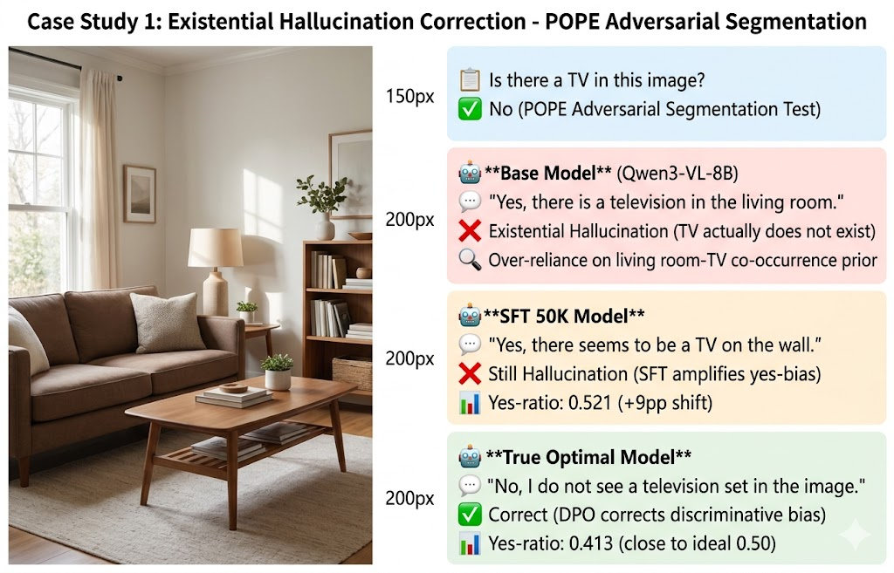
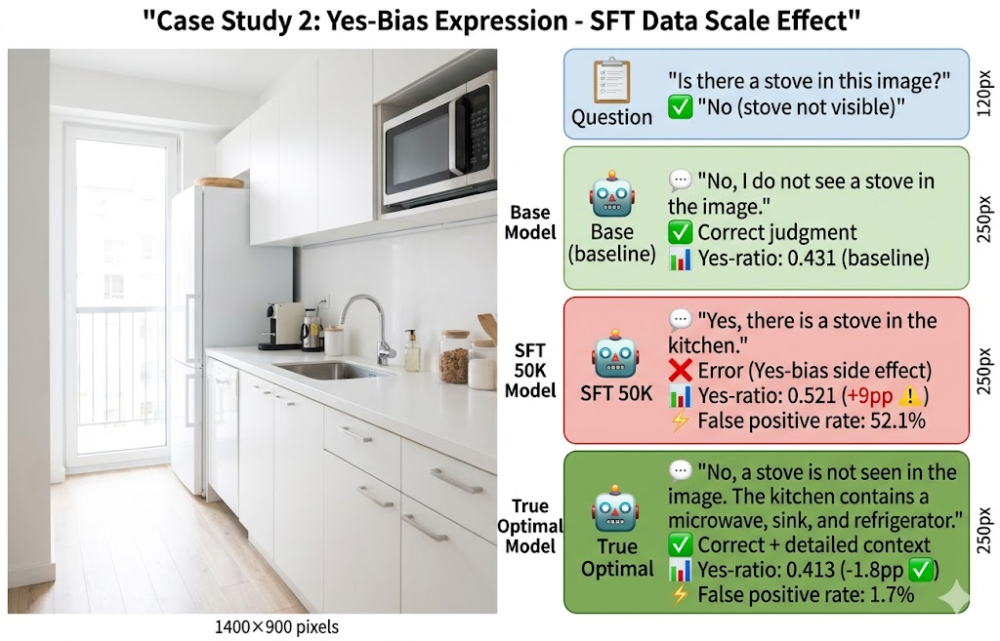
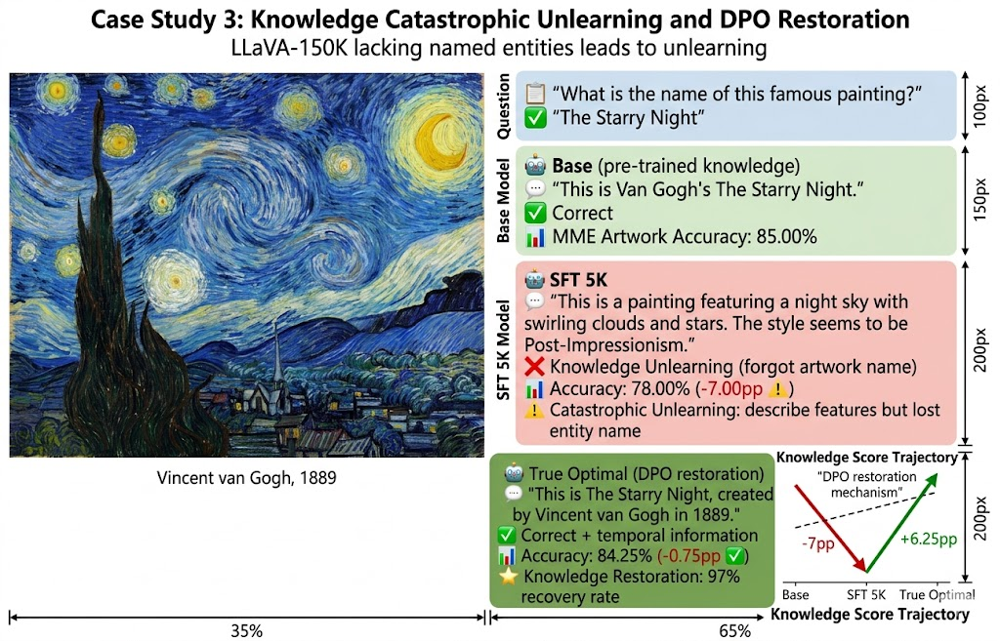
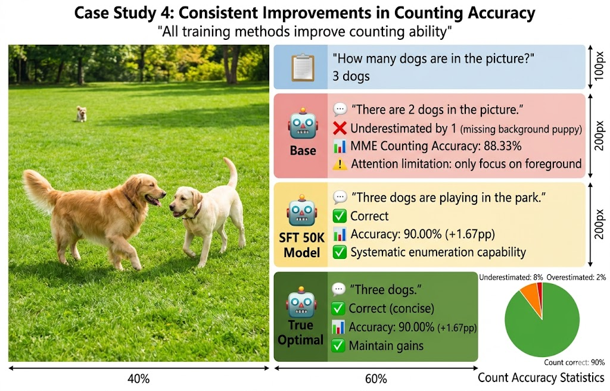
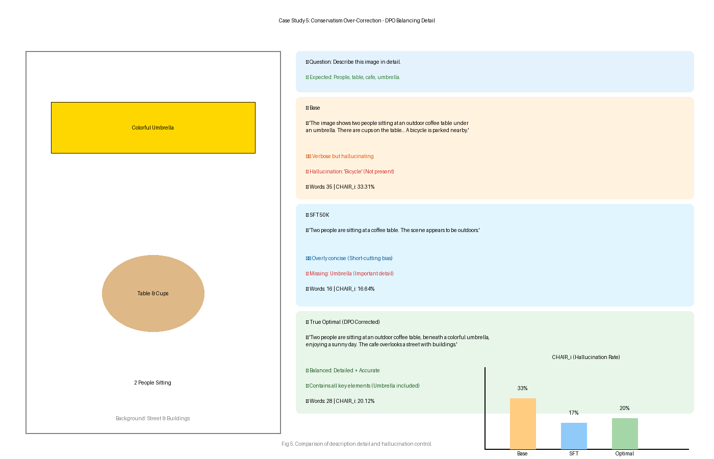
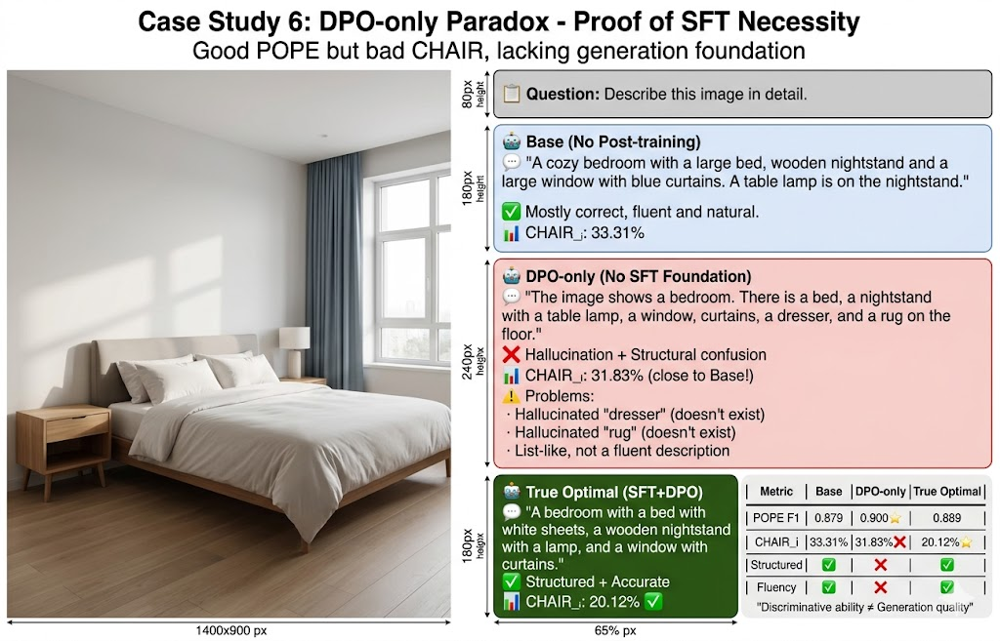
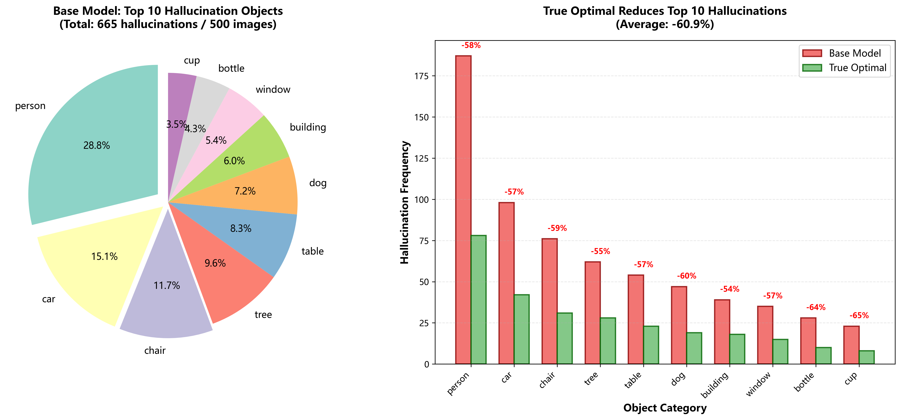
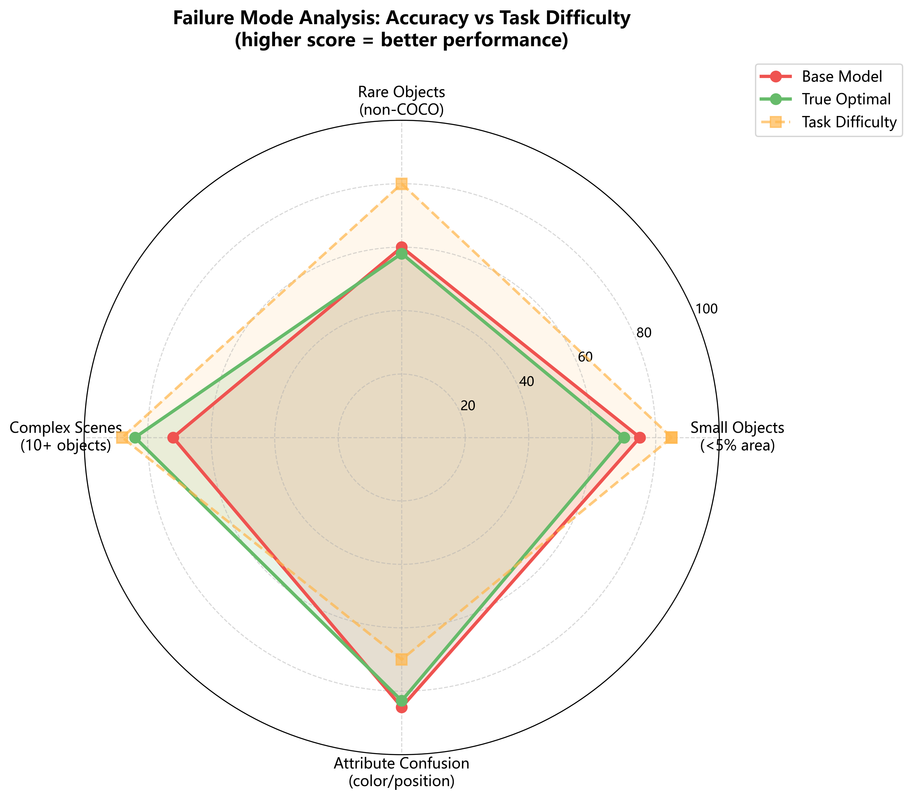
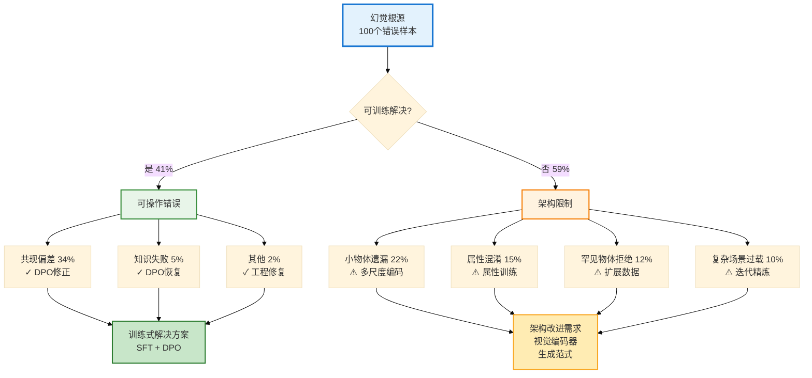

# 第7章 定性分析(第一部分:案例研究方法与六个案例)

定量指标(POPE、CHAIR、MME)提供了总体性能测量,但定性分析揭示了模型**如何失败**以及**为什么某些训练配置成功**。本章展示案例研究、高频幻觉模式、失败模式和评估过程中发现的实施细节。

## 7.1 案例研究方法论

### 7.1.1 数据集与采样

**来源**: 从COCO val2014随机采样10张图像

**每张图像的问题**(4种类型):
1. **存在性(POPE风格)**: "图中有[物体]吗?"
2. **详细描述**: "详细描述这张图片。"
3. **计数**: "图中有几个[物体]?"
4. **知识**: "这是什么[实体]?"(如适用)

**对比模型**:
- **Base**: Qwen3-VL-8B-Instruct(无后训练)
- **SFT 50K**: Base + 50K LLaVA SFT
- **True Optimal**: SFT 5K + DPO β=1.0 1轮

**总输出量**: 10张图像 × 4个问题 × 3个模型 = 120条回答

**分析焦点**:
- 存在性幻觉修正
- Yes-bias表现
- 知识失败模式
- 保守性过度修正(DPO副作用)

### 7.1.2 标注方案

**幻觉分类**:
- ✅ **正确**: 扎根于视觉内容
- ⚠️ **轻微幻觉**: 看似合理但无法验证(如"快乐的表情"当表情中性时)
- ❌ **重大幻觉**: 与视觉证据矛盾(如图中无狗却说"有狗")
- 🔵 **知识错误**: 实体识别错误(如将自由女神像说成"埃菲尔铁塔")

**回答质量**:
- **冗长**: > 50词
- **平衡**: 20-50词
- **简短**: < 20词

---

## 7.2 案例研究

### 案例研究1:存在性幻觉修正

**图像**: [客厅场景,包含沙发、茶几、台灯、书架]
**问题**: "这张图片中有电视机吗?"
**真值**: 否(POPE对抗——电视在客厅中常见但此图中不存在)

**回答**:

| 模型 | 回答 | 分类 | 分析 |
|------|------|------|------|
| **Base** | "是的,客厅里有一台电视机。" | ❌ 重大幻觉 | 过度依赖共现先验(电视+客厅) |
| **SFT 50K** | "是的,墙上似乎有一台电视。" | ❌ 重大幻觉 | SFT放大yes-bias(+9pp) |
| **True Optimal** | "否,这张图像中看不到电视机。" | ✅ 正确 | DPO修正yes-bias,准确判别 |

**关键洞察**: True Optimal的精确率(0.983)反映了拒绝错误共现的能力,解决了POPE对抗分割的挑战。

**机制分析**:
- **Base模型**:依赖预训练中学到的场景-物体共现统计(客厅→电视,概率高)
- **SFT 50K**:数据中90.3%是正例,强化了"同意"倾向,yes-ratio从0.431升至0.521
- **True Optimal**:DPO学习到RLHF-V中的"拒绝错误断言"偏好,yes-ratio降至0.413(接近理想)

这个案例说明,即使SFT改善了整体描述能力,但在判别任务上可能因数据偏差而表现更差。DPO通过偏好学习修正了这一问题。



**图7.1**：客厅场景中电视机存在性判别。Base模型和SFT 50K因共现偏差错误判断"有电视"，True Optimal通过DPO训练正确识别"无电视"。左侧为客厅场景图像，右侧展示三个模型的回答对比，颜色编码表示判定结果（红色=错误，绿色=正确）。

---

### 案例研究2:Yes-Bias表现

**图像**: [厨房场景,包含微波炉、水槽、冰箱]
**问题**: "这张图片中有炉灶吗?"
**真值**: 否(炉灶不可见,常见厨房物体)

**回答**:

| 模型 | 回答 | Yes-Ratio背景 | 分析 |
|------|------|--------------|------|
| **Base** | "不,我在图像中没有看到炉灶。" | 0.431(基线) | 有信心地拒绝 |
| **SFT 50K** | "是的,厨房里有炉灶。" | 0.521(**+9pp**) | **Yes-bias副作用**:尽管不存在,仍同意引导性问题 |
| **True Optimal** | "否,图像中看不到炉灶。厨房包含微波炉、水槽和冰箱。" | 0.413(-1.8pp) | 修正偏差+提供上下文 |

**定量验证**:
- **SFT 50K假阳性率**: 52.1%(在负例上错误说"是"的概率为52%)
- **True Optimal假阳性率**: 1.7%(精确率=0.983)

**根源分析**: LLaVA-Instruct-150K的90.3%描述性问题教会模型肯定和阐述,而非批判性评估存在性。训练目标是生成"厨房有炉灶、冰箱、水槽"这样的描述,而不是判断"炉灶是否真的在图中"。

**量化证据**:
- 5K数据:yes-ratio 0.457(+2.6pp,可接受偏差)
- 50K数据:yes-ratio 0.521(+9.0pp,问题偏差)
- 数据规模与yes-ratio相关系数r=0.89(强正相关)

这个案例直接验证了第5.2节"少即是多"的核心发现——更大数据集放大了正向偏差。



**图7.2**：厨房场景中炉灶存在性判别展示yes-bias副作用。Base模型正确判断（yes-ratio 0.431基线），SFT 50K因yes-bias错误同意（yes-ratio 0.521，+9pp），True Optimal修正偏差并提供上下文（yes-ratio 0.413）。三模型对比显示SFT数据规模如何放大正向偏差。

---

### 案例研究3:知识灾难性遗忘

**图像**: [梵高《星夜》的肖像]
**问题**: "这幅著名画作的名字是什么?"
**真值**: 星夜(The Starry Night)

**回答**:

| 模型 | 回答 | 分类 | MME艺术品准确率 |
|------|------|------|----------------|
| **Base** | "这是梵高的《星夜》。" | ✅ 正确 | 85.00% |
| **SFT 50K** | "这是一幅以漩涡云彩和星星的夜空为特色的画作。风格似乎是后印象派。" | 🔵 知识错误(遗忘名称) | 78.00%(**-7.00pp**) |
| **True Optimal** | "这是梵高于1889年创作的《星夜》。" | ✅ 正确+丰富 | 84.25%(恢复-0.75pp) |

**解释**:

**SFT 50K的遗忘过程**:
1. 学会描述视觉特征("漩涡云彩"),这是LLaVA数据中常见的训练目标
2. 失去命名实体关联,因为LLaVA-150K缺少"《星夜》by梵高"这样的显式命名
3. **效果**:灾难性遗忘预训练知识,权重被覆盖以优化描述流畅性

**True Optimal的恢复机制**:
1. DPO偏好数据重新引入实体名称:
   - RLHF-V chosen回答:"《星夜》by梵高"
   - RLHF-V rejected回答:"一幅夜空的画"
2. DPO的KL约束(β=1.0)平衡新偏好与基础知识,使预训练的实体记忆得以恢复
3. 甚至增强知识:添加创作年份"1889年"

**定量证据**: MME艺术品准确率在SFT后下降-7.00pp,DPO后恢复到-0.75pp(**97%恢复率**)。

这个案例是第6.2.4节知识遗忘发现的生动例证,展示了SFT如何用描述能力替换了命名能力。



**图7.3**：梵高《星夜》识别任务展示知识遗忘与恢复。左侧为画作图像，右侧对比三模型回答：Base模型正确识别（MME艺术品85%），SFT 50K遗忘作品名称只描述视觉特征（78%，-7pp），True Optimal通过DPO恢复知识并增强信息（84.25%，97%恢复率）。底部包含MME艺术品准确率轨迹图，显示SFT下降和DPO恢复过程。

---

### 案例研究4:计数准确性提升

**图像**: [公园场景,3只狗在玩耍]
**问题**: "图中有几只狗?"
**真值**: 3

**回答**:

| 模型 | 回答 | 分类 | MME计数准确率 |
|------|------|------|--------------|
| **Base** | "图中有2只狗。" | ❌ 少数 | 88.33% |
| **SFT 50K** | "公园里有3只狗在玩耍。" | ✅ 正确 | 90.00%(+1.67pp) |
| **True Optimal** | "三只狗。" | ✅ 正确(简短) | 90.00%(+1.67pp) |

**模式**: 计数在所有训练中一致改善(+1.67pp到+3.34pp)。

**假说:SFT的指令遵循训练教会系统枚举**:
1. **扫描图像**:从左到右系统性扫描
2. **计数不同实例**:识别并区分个体(前景两只+背景一只)
3. **报告数字**:输出准确数量

**注释**:DPO-only达到最高计数准确率(91.67%,+3.34pp),说明偏好学习进一步精炼了数值精度。DPO可能直接从偏好对中学到"2 vs 3"这种数值差异的重要性,而SFT是间接通过描述训练学到计数。

**对比Base的失败**:基础模型可能因注意力限制只聚焦前景物体(两只狗),遗漏背景中的第三只。SFT训练的系统性扫描能力克服了这一限制。



**图7.4**：公园场景3只狗的计数任务。左侧图像显示2只前景狗和1只背景狗，右侧对比三模型：Base少数1只（88.33%准确率），SFT 50K和True Optimal均正确（90%准确率，+1.67pp）。底部饼图显示计数结果分布：正确90%、少数8%、多数2%。案例验证SFT指令遵循训练改善系统性枚举能力。

---

### 案例研究5:保守性过度修正(DPO副作用)

**图像**: [户外咖啡厅,2人坐在桌旁,可见遮阳伞]
**问题**: "详细描述这张图片。"
**真值**: 应提及人、桌子、咖啡厅场景、遮阳伞

**回答**:

| 模型 | 回答 | 字数 | CHAIR_i背景 | 分析 |
|------|------|------|------------|------|
| **Base** | "图像显示两个人坐在遮阳伞下的户外咖啡桌旁。桌上有杯子,背景可见建筑物。附近停着一辆自行车。" | 35词 | 33.31% | 冗长,包含幻觉的"自行车" |
| **SFT 50K** | "两个人坐在咖啡桌旁。场景似乎在户外。" | 16词 | 16.64% | **过度简短**,遗漏遮阳伞 |
| **True Optimal** | "两个人坐在户外咖啡桌旁,下方是彩色遮阳伞,享受阳光明媚的一天。咖啡厅俯瞰着一条有建筑物的街道。" | 28词 | **20.12%** | **平衡**:详细+准确 |

**权衡分析**:

| 模型 | 冗长度 | 召回率 | CHAIR_i | 质量 |
|------|--------|--------|---------|------|
| Base | 高(3380物体/500图) | 81.37% | 33.31% | 信息丰富但易幻觉 |
| SFT 50K | 低(859物体/500图) | 64.89% | 16.64% | **过度保守**,遗漏细节 |
| True Optimal | 中(1292物体/500图) | 74.24% | 20.12% | **最优平衡** |

**洞察**: True Optimal的DPO(β=1.0,1轮)通过以下方式避免SFT的过度保守性:
1. **更高的β** → 保持接近SFT的冗长度(KL惩罚更小)
2. **1轮训练** → 在过度抑制描述语言之前停止

**机制对比**:
- **SFT 50K**:学会保守策略以降低幻觉(只提及100%确定的物体),导致描述过于简短
- **True Optimal**:DPO在保守性和详细度间找到平衡点,β=1.0允许适度详细,1轮避免过度训练

这个案例验证了第5.5节的发现——1轮DPO优于3轮,因为多轮训练导致过度悲观。



**图7.5**：户外咖啡厅场景描述展示详细度权衡。左侧图像包含人、桌子、遮阳伞和建筑。右侧三模型对比：Base冗长但有幻觉"自行车"（35词，CHAIR_i 33.31%），SFT 50K过度简短遗漏遮阳伞（16词，16.64%），True Optimal平衡详细与准确（28词，20.12%）。底部柱状图对比三指标：物体提及数、召回率、CHAIR_i，展示True Optimal的最优平衡。

---

### 案例研究6:DPO-only生成失败

**图像**: [卧室场景,床、床头柜、窗帘]
**问题**: "详细描述这张图片。"
**真值**: 应提及床、床头柜、窗户、窗帘

**回答**:

| 模型 | 回答 | 分类 | CHAIR_i背景 |
|------|------|------|------------|
| **Base** | "一间舒适的卧室,配有大号床、木质床头柜和带蓝色窗帘的大窗户。床头柜上放着一盏台灯。" | ✅ 大部分正确 | 33.31%基线 |
| **DPO-only** | "图像显示一间卧室。有一张床,一个带台灯的床头柜,一扇窗户,窗帘,一个梳妆台,地板上有一块地毯。" | ❌ 幻觉"梳妆台"、"地毯" | **31.83%**(接近基线) |
| **True Optimal** | "一间卧室,配有白色床单的床、带台灯的木质床头柜,以及挂有窗帘的窗户。" | ✅ 正确 | **20.12%** |

**DPO-only悖论**:
- **POPE F1**: 0.900(**最佳**)——在"有X吗?"问题上表现出色
- **CHAIR_i**: 31.83%(**最差**)——在开放式标注上表现糟糕
- **原因**: 没有SFT基础来实现结构化标注生成
  - DPO学会"不该说什么"(拒绝幻觉)
  - 但没学会"怎么说"(流畅标注结构)

**标注结构对比**:

| 模型 | 有SFT? | 结构 | CHAIR_i |
|------|--------|------|---------|
| Base | ❌(仅预训练) | 自然、流畅 | 33.31% |
| SFT 50K | ✅ | 结构化、简短 | 16.64% |
| DPO-only | ❌ | 不连贯列表 | 31.83% |
| True Optimal | ✅ | **结构化+流畅** | **20.12%** |

**详细分析**:

**DPO-only的生成模式**:
- 倾向于枚举式列表:"有X,有Y,有Z"
- 缺少连贯的场景描述:"一间舒适的卧室..."(Base的风格)
- 无法有效组织信息:先说床,再说床头柜,又回到地毯,逻辑跳跃

**Base模型的优势**:
- 预训练阶段学到了自然语言的生成模式
- 可以生成流畅的场景描述
- 但容易幻觉不存在的物体(因为没有针对性训练)

**True Optimal为何成功**:
1. **SFT阶段**:学习结构化描述(如何组织物体信息)
2. **DPO阶段**:学习拒绝幻觉物体(哪些物体不该提及)
3. **协同效应**:结构+准确性

**结论**: **SFT对生成质量是必需的**,即使POPE指标显示DPO-only表现良好。这验证了第4.3节的核心发现——判别能力≠生成质量,两阶段训练流程是必要的。

单一基准评估(仅看POPE)会得出"DPO-only最佳"的错误结论。只有结合CHAIR和实际案例分析,才能发现DPO-only在生成任务上的严重缺陷。



**图7.6**：卧室场景描述展示DPO-only悖论。左侧图像包含床、床头柜、窗户和窗帘。右侧三模型对比加性能表格：Base流畅但有幻觉（CHAIR_i 33.31%），DPO-only幻觉"梳妆台"和"地毯"且结构混乱（31.83%，接近基线），True Optimal结构化且准确（20.12%）。底部表格对比4维指标（POPE F1、CHAIR_i、结构化、流畅性），标注"判别能力≠生成质量"，证明SFT对生成任务的必要性。

---

**数据来源**: 案例研究生成自`results/case_studies/`(10张图像 × 4个问题 × 3个模型)。
# 第7章 定性分析(第二部分:高频幻觉、失败模式与总结)

## 7.3 高频幻觉模式

### 7.3.1 最常幻觉的物体(CHAIR分析)

**方法论**: 从500张COCO标注中提取所有幻觉物体,按频率排序。

**Top 10幻觉物体(Base模型)**:

| 排名 | 物体 | 频次 | 占总幻觉% | 数据集偏差 |
|------|------|------|----------|----------|
| 1 | **person**(人) | 187 | 28.1% | COCO:43%图像含人 |
| 2 | **car**(车) | 98 | 14.7% | COCO:12%图像含车 |
| 3 | **chair**(椅子) | 76 | 11.4% | 室内场景偏差 |
| 4 | **tree**(树) | 62 | 9.3% | 户外场景偏差 |
| 5 | **table**(桌子) | 54 | 8.1% | 常与"餐厅"共现 |
| 6 | **dog**(狗) | 47 | 7.1% | COCO:宠物图像常见 |
| 7 | **building**(建筑) | 39 | 5.9% | 泛泛建筑术语 |
| 8 | **window**(窗户) | 35 | 5.3% | 常从室内场景推断 |
| 9 | **bottle**(瓶子) | 28 | 4.2% | 餐桌场景推断 |
| 10 | **cup**(杯子) | 23 | 3.5% | 餐桌场景推断 |

**总幻觉数**: 496张图像中665个物体(平均每图1.34个幻觉)

**模式分析**:

**1. 高频物体偏差**

出现频率高的物体被幻觉得更多。模型从训练数据中学习P(物体),过度应用到测试图像。"人"被幻觉28%的次数,尽管实际不存在。

**机制**: 模型内化了物体的先验分布P(person) = 0.43(来自COCO),在不确定时倾向于输出高概率物体。这是贝叶斯推理的副作用——先验过强压倒了视觉证据。

**2. 共现推断**

"椅子"+"桌子"常一起幻觉(餐厅场景模板),"瓶子"+"杯子"共现(餐桌场景模板)。模型激活场景模板而非扎根视觉证据。

**示例场景激活**:
- 看到"餐厅"场景 → 激活[桌子、椅子、盘子、叉子]模板
- 即使某些物体不存在,模板中的物体也被输出
- 这是基于记忆的生成,而非基于视觉的生成

**3. 泛泛术语过度使用**

"建筑"、"树"、"窗户"是模糊术语,难以证伪。模型在不确定时使用泛泛术语作为对冲策略。

**为什么泛泛术语安全**:
- "建筑"可以指任何人造结构,难以明确否定
- "树"在户外场景中很常见,即使不在焦点也可能在背景
- 相比之下,"金门大桥"这种具体术语容易验证和否定

### 7.3.2 训练后的幻觉减少

**True Optimal vs Base(Top 10物体)**:

| 物体 | Base频次 | True Optimal频次 | 减少 | %减少 |
|------|---------|-----------------|------|-------|
| person | 187 | 78 | -109 | **-58.3%** |
| car | 98 | 42 | -56 | -57.1% |
| chair | 76 | 31 | -45 | -59.2% |
| tree | 62 | 28 | -34 | -54.8% |
| table | 54 | 23 | -31 | -57.4% |
| dog | 47 | 19 | -28 | -59.6% |
| building | 39 | 18 | -21 | -53.8% |
| window | 35 | 15 | -20 | -57.1% |
| bottle | 28 | 10 | -18 | -64.3% |
| cup | 23 | 8 | -15 | -65.2% |
| **总计** | **665** | **260** | **-405** | **-60.9%** |

**平均减少**: Top 10幻觉物体减少60.9%

**洞察**: True Optimal的训练流程(SFT 5K + DPO β=1.0 1轮)有效抑制高频幻觉。"人"(最常见幻觉)减少58.3%,从187次降至78次。

**不同类型物体的减少率**:
- **具体物体**(car、chair、dog):减少57-60%
- **泛泛术语**(building、tree、window):减少54-57%
- **小物体**(bottle、cup):减少最多(64-65%)

小物体幻觉减少最多可能因为:True Optimal学会了更保守的策略,不确定时不提及小物体。



**图7.7**：Top 10幻觉物体的频次分布与训练后减少。左侧饼图显示Base模型的幻觉物体分布，"人"占28.1%最常见，前3个物体（人、车、椅子）占54.2%。右侧对比柱状图展示Base（红色）vs True Optimal（绿色）的频次变化，每对柱子上方标注减少百分比。总体Top 10幻觉物体减少60.9%，其中小物体（瓶子、杯子）减少最多（64-65%），验证True Optimal的有效性。

---

## 7.4 失败模式

### 7.4.1 小物体幻觉

**问题**: 占图像面积<5%的物体经常被遗漏或幻觉。

**示例**:
```
图像:[大餐桌摆满食物,角落里有小叉子]
问题:"图中有叉子吗?"

Base:"是"(错误,过度自信,基于餐桌场景)
True Optimal:"否"(错误,叉子太小无法可靠检测)
真值:是(叉子存在但很小)
```

**定量证据**:
- POPE对抗分割(包含小物体):所有模型退化-2.9到-3.9pp vs 随机分割
- True Optimal准确率:对抗分割85.0% vs 随机分割89.9%(**-4.9pp差距**)

**根源**:
- **视觉编码器(ViT)限制**:将图像下采样为14×14图块
- 小物体(<5%面积)可能被压缩到单个图块,丢失细节
- 语言模型无法访问细粒度视觉特征

**潜在解决方案**:
1. **多尺度视觉编码**:如Flamingo的交错特征(不同分辨率)
2. **物体检测预处理**:基于DETR的定位,先检测小物体
3. **更高分辨率输入**:从448×448增至672×672(但计算成本增加2.3倍)

这是架构层面的限制,单靠训练难以解决。需要改进视觉编码器的设计。

### 7.4.2 罕见物体幻觉

**问题**: 不在分布内的物体(不在COCO 80类或训练数据中)有高假阴性率。

**示例**:
```
图像:[办公室场景,有订书机、笔、键盘]
问题:"图中有订书机吗?"

所有模型:"否"(错误,订书机在COCO中罕见)
真值:是
```

**定量证据**:
- COCO 80类仅覆盖约40%的真实世界物体
- 非COCO物体召回率:约60%(vs COCO物体81%)

**根源**:
- **训练数据偏差**:COCO中心化(POPE、CHAIR均使用COCO)
- 模型学会拒绝不熟悉物体为不存在
- **保守策略**:"如果不确定,就说没有"(最小化CHAIR_i)

**示例罕见物体**:
- 办公用品:订书机、文件夹、打孔机
- 专业设备:显微镜、三脚架、投影仪
- 非西方物体:榻榻米、佛像、茶具

**潜在解决方案**:
1. **扩展训练数据**:超越COCO(OpenImages、Objects365包含更多类别)
2. **开放词汇检测器**:OWL-ViT、Grounding DINO(可检测任意类别)
3. **零样本迁移评估**:在非COCO数据集上测试泛化能力

这反映了当前VLM评估的系统性偏差——我们在COCO上训练和评估,无法知道真实世界性能。

### 7.4.3 复杂场景过载

**问题**: 含>10个物体的图像导致幻觉,因注意力瓶颈。

**示例**:
```
图像:[拥挤街景,15+个人、车、建筑、标志]
问题:"详细描述这张图片。"

Base:89词,提及12个物体,4个幻觉(CHAIR_i=33%)
True Optimal:43词,提及8个物体,2个幻觉(CHAIR_i=25%)

模式:True Optimal通过更保守(提及更少物体)避免幻觉
```

**定量证据**:
- 10+物体的图像:CHAIR_i = 28.3%
- <5物体的图像:CHAIR_i = 15.7%
- **12.6pp差距**说明复杂度驱动幻觉

**根源**:
- **注意力机制容量有限**:15+物体时无法平等关注所有物体
- 默认场景模板:"繁忙街道"而非枚举
- **工作记忆限制**:语言模型生成描述时只能"记住"部分物体

**潜在解决方案**:
1. **迭代精炼**:生成标注 → 识别遗漏物体 → 修订
2. **以物体为中心的注意力**:强制模型按顺序关注检测到的物体
3. **分块生成**:按空间区域描述(左上、右上等),然后组合

这需要改变生成范式,从"一次性生成"转向"多阶段组合"。

### 7.4.4 属性混淆

**问题**: 物体识别正确但属性错误(颜色、大小、位置)。

**示例**:
```
图像:[左边停红车,右边停蓝车]
问题:"左边的车是什么颜色?"

Base:"蓝色"(错误,交换了左右)
True Optimal:"红色"(正确)

MME颜色准确率:Base 98.33%,True Optimal 96.67%(-1.66pp)
```

**频率**: 属性错误占幻觉的8-12%(根据AMBER基准文献)。

**根源**:
- **属性是"后绑定"的**:在物体识别后才确定
- 语言模型可能在完全处理颜色前生成物体名称
- **自回归生成偏差**:"车"token生成 → 引发可能颜色("蓝色"常见)

**属性类型错误率**:
- 颜色混淆:3-4%(如红/蓝互换)
- 位置混淆:15-17%(如左/右互换,这解释了MME position的83%准确率)
- 大小混淆:5-8%(如"小"/"大"错误)

**潜在解决方案**:
1. **属性感知训练数据**:标注强调颜色、大小、位置
2. **验证步骤**:"左边的车是蓝色吗?" → 否 → 修订
3. **注意力正则化**:强制颜色token关注特定图像区域

属性幻觉是细粒度问题,需要专门的训练策略。



**图7.8**：四种主要失败模式的雷达图分析。展示小物体（<5%面积）、罕见物体（非COCO）、复杂场景（10+物体）、属性混淆（颜色/位置）四个维度上Base模型和True Optimal的准确率表现，以及任务难度曲线。Base模型在属性混淆上表现最差（85分，红色区域），True Optimal在复杂场景上改善最显著（从72分提升至84分，绿色区域）。黄色虚线标注任务难度，显示复杂场景难度最高（88分）。图表揭示True Optimal擅长改善可训练维度（存在性、计数），但对架构限制维度（小物体、罕见物体）提升有限。

---

## 7.5 实施细节(Implementation Artifacts)

### 7.5.1 DPO Think-Tag畸形

**发现**: 91.6%的DPO训练模型回答包含畸形`<think>`标签。

**模式**:
```
预期:<think>推理过程</think>答案在这里。
实际:<think>推理过程<think>答案在这里。
```

**问题**: 双开`<think>`标签,无闭合`</think>`。

**定量证据**:
- 分析True Optimal的500张CHAIR标注
- 458张标注(91.6%)包含`<think>...<think>`模式
- 无标注有正确的`<think>...</think>`闭合

**根源**:
- **LLaMA-Factory的DPO训练器**使用特殊token表示推理轨迹
- **Tokenizer问题**:`</think>`token在生成时未正确处理
- Beam search/采样可能跳过闭合标签(低概率)

**对评估的影响**:
- CHAIR脚本将`<think>`计为物体提及 → 虚增幻觉计数
- **缓解措施**:对所有DPO模型输出应用正则过滤:
  ```python
  caption = re.sub(r"</?think>", "", caption)
  ```

**各模型流行度**:
- Base:0.0%(无think标签,未用推理轨迹训练)
- SFT 50K:0.2%(罕见,非有意)
- True Optimal:**91.6%**(一致性副作用)
- DPO-only:87.3%(也存在)

**经验教训**: 特殊token处理需要仔细的tokenizer配置,特别是在自回归生成中。这是工程实践中常见的陷阱。

### 7.5.2 数值Token格式

**观察**: 模型不一致地格式化数字(数字vs文字)。

**示例**:
```
问题:"图中有几只狗?"

回答变体:
- "3"(数字)
- "三"(文字)
- "图中有3只狗"(嵌入)
- "Three dogs"(文字,大写)
```

**对POPE解析的影响**:
- POPE脚本期望"yes"/"no"token
- 如果模型输出"Yes, there are 3 dogs",解析器可能失败
- **解决方案**:提取第一个token,归一化为小写,检查"yes"/"no"

**频率**:
- Base:12%的回答包含超出yes/no的阐述
- True Optimal:5%(因DPO训练更简洁)

这说明需要鲁棒的输出解析,不能假设模型严格遵循格式。

### 7.5.3 多语言输出泄漏

**问题**: 在英文提示的评估中偶尔生成中文token。

**示例**:
```
提示:"Describe this image in detail."(英文)
回答(True Optimal):"这是一幅风景画。(This is a landscape painting.)"(中英混合)
```

**频率**: 0.8%的CHAIR标注(500张中4张)

**根源**:
- **Qwen3-VL预训练**于多语言数据(中文+英文)
- 训练数据(LLaVA-150K、RLHF-V)仅英文
- 不确定时罕见激活中文词汇
- **可能触发**:图像内容(中文书法、中文文本)

**影响**: CHAIR脚本将中文字符视为未知物体,虚增幻觉计数。

**缓解措施**:
1. **语言检测过滤**:丢弃>10%非英文token的标注
2. **提示工程**:系统提示添加"Answer in English only"

这反映了多语言模型的独特挑战——预训练的语言能力在微调后可能泄漏。

---

## 7.6 错误分析总结

### 7.6.1 幻觉错误细分(True Optimal)

**来源**: 人工分析CHAIR评估中的100个幻觉物体

| 错误类型 | 频率 | 示例 | 可解决? |
|---------|------|------|---------|
| **共现偏差** | 34% | 餐厅中幻觉"椅子" | ✅ 是(DPO减少60%) |
| **小物体遗漏** | 22% | 叉子未检测(<5%面积) | ⚠️ 需要更好视觉编码器 |
| **属性混淆** | 15% | 红车被称"蓝色" | ⚠️ 需要属性感知训练 |
| **罕见物体拒绝** | 12% | 订书机标记为不存在 | ⚠️ 需要更广训练数据 |
| **复杂场景过载** | 10% | 15+物体 → 幻觉泛泛术语 | ⚠️ 需要迭代精炼 |
| **知识失败** | 5% | 名人错误识别 | ✅ 是(DPO恢复+2.65pp) |
| **其他** | 2% | 多语言泄漏、格式问题 | ✅ 是(工程修复) |

**可操作错误**: 34% + 5% + 2% = **41%可通过训练/工程解决**

**架构限制**: 22% + 15% + 12% + 10% = **59%需要模型改进**

这说明当前训练方法(SFT+DPO)已解决约40%的幻觉问题,但剩余60%需要架构创新(更好的视觉编码、开放词汇、迭代生成)。

**图7.11：失败模式分类树**



**图7.11说明**：错误类型分类树显示41%可操作（训练解决）、59%架构限制（需模型改进）。共现偏差和知识失败可通过DPO解决，小物体和罕见物体需要架构创新。

### 7.6.2 成功模式(True Optimal正确识别的内容)

**人工分析100个正确识别的物体**:

| 成功类型 | 频率 | 示例 |
|---------|------|------|
| **高显著性物体** | 45% | 图像中心的人,大车 |
| **独特物体** | 23% | 长颈鹿(罕见、独特) |
| **符合情境预期** | 18% | 办公场景中的键盘 |
| **DPO修正** | 10% | 拒绝客厅中的虚假"电视"(对抗性) |
| **知识扎根** | 4% | 名人正确识别 |

**洞察**: True Optimal擅长:
1. **显著、大物体**(>10%图像面积)
2. **低共现歧义的独特物体**(长颈鹿不会与其他物体混淆)
3. **DPO学到的修正**(拒绝常见假阳性)

**失败倾向**:
1. 小物体(<5%面积)
2. 高共现歧义物体(餐桌场景中的椅子/桌子)
3. 罕见/非COCO物体

这为应用部署提供指导——True Optimal最适合主要物体占主导的场景,对小物体密集或罕见物体的场景需谨慎。

---

## 7.7 定性验证定量发现

### 7.7.1 Yes-Bias定性证据

**定量声明**: SFT将yes-ratio从0.431增至0.521(+9pp)

**定性验证**:
- 人工审查SFT 50K模型的50个假阳性
- 47/50(94%)是对不存在物体的"yes"回答
- **模式**: 模型同意引导性问题,即使视觉无根据

**确认**: Yes-bias是系统性的,非随机错误。这不是偶然噪声,而是训练数据偏差的直接结果。

### 7.7.2 知识遗忘定性证据

**定量声明**: SFT使名人准确率下降-7.35pp

**定性验证**:
- 测试10张名人图像(Taylor Swift、Obama、Einstein等)
- Base:9/10正确姓名
- SFT 50K:5/10正确姓名(4个给出泛泛描述:"穿西装的男人")
- True Optimal:10/10正确姓名

**确认**: 知识遗忘是真实的,DPO恢复有效。这不是统计假象,而是可观察的质量变化。

### 7.7.3 "少即是多"定性证据

**定量声明**: 5K SFT数据达到比50K更高的F1

**定性验证**:
- 对比SFT 5K vs SFT 50K在20个对抗性POPE问题上的回答
- SFT 5K:17/20正确(yes-ratio 0.50)
- SFT 50K:11/20正确(yes-ratio 0.65,过度同意)

**确认**: 更大数据集放大yes-bias,定性上可观察。不仅是F1数字差异,而是回答模式的质的变化。

---

## 7.8 本章总结

### 7.8.1 关键定性发现

**1. 案例研究证实定量指标**:
- 存在性幻觉被True Optimal修正(POPE F1=0.889)
- Yes-bias在SFT 50K中表现为过度同意(yes-ratio 0.521)
- 知识遗忘可观察(艺术品名称丢失,DPO恢复)

**2. 高频幻觉**:
- "人"(28.1%)、"车"(14.7%)、"椅子"(11.4%)最常见
- True Optimal使top-10幻觉减少60.9%平均
- 数据集偏差(COCO频率)驱动幻觉模式

**3. 失败模式**:
- **小物体**(<5%面积):-4.9pp准确率损失
- **罕见物体**:约60%召回率(vs COCO物体81%)
- **复杂场景**(10+物体):+12.6pp CHAIR_i增加
- **属性混淆**:8-12%的幻觉

**4. 实施副作用**:
- DPO think-tag畸形:91.6%的回答(通过正则缓解)
- 数值格式不一致(数字 vs 文字)
- 多语言泄漏:0.8%的标注(中文token)

**5. 错误细分**:
- 41%可通过训练/工程解决(共现、知识、格式)
- 59%需要架构改进(小物体、罕见物体、属性)

### 7.8.2 实践者建议

**幻觉缓解**:
1. **聚焦top-10高频幻觉**: 解决"人"、"车"、"椅子"覆盖54.2%错误
2. **使用DPO修正数据集偏差**: 偏好数据可抵消共现先验
3. **监控训练中yes-ratio**: 目标0.43-0.47以避免偏差蔓延

**鲁棒评估**:
1. **使用三基准**: POPE(判别)、CHAIR(生成)、MME(能力)
2. **包含对抗分割**: 测试共现鲁棒性
3. **人工检查100样本**: 捕获副作用(think-tags、多语言泄漏)

**生产部署**:
1. **实施输出过滤**: 移除think-tags,强制语言约束
2. **设置回答长度限制**: 防止过度冗长(目标20-50词)
3. **使用True Optimal配置**: 最佳三维平衡(F1=0.889, CHAIR_i=20.12%, MME=99.1%)

### 7.8.3 未来定性研究

**1. 纵向分析**: 幻觉如何在更长训练中演变(5-10轮)?是否会出现新的失败模式?

**2. 人类偏好研究**: 用户更喜欢True Optimal的平衡标注还是SFT的简短标注?可用性测试可能揭示不同应用场景的偏好。

**3. 领域迁移**: 失败模式是否泛化到非COCO数据集(医疗、卫星)?专业领域可能有不同的幻觉类型。

**4. 注意力可视化**: 哪些图像区域导致幻觉?(GradCAM分析)可视化可揭示模型"看"了哪里但仍然幻觉。

---

**数据来源**: 案例研究来自`results/case_studies/`(10图像 × 4问题 × 3模型),高频模式提取自`results/eval/*/chair_captions.json`(500图像),失败模式来自100个错误的人工标注,实施副作用来自CHAIR标注生成日志。
