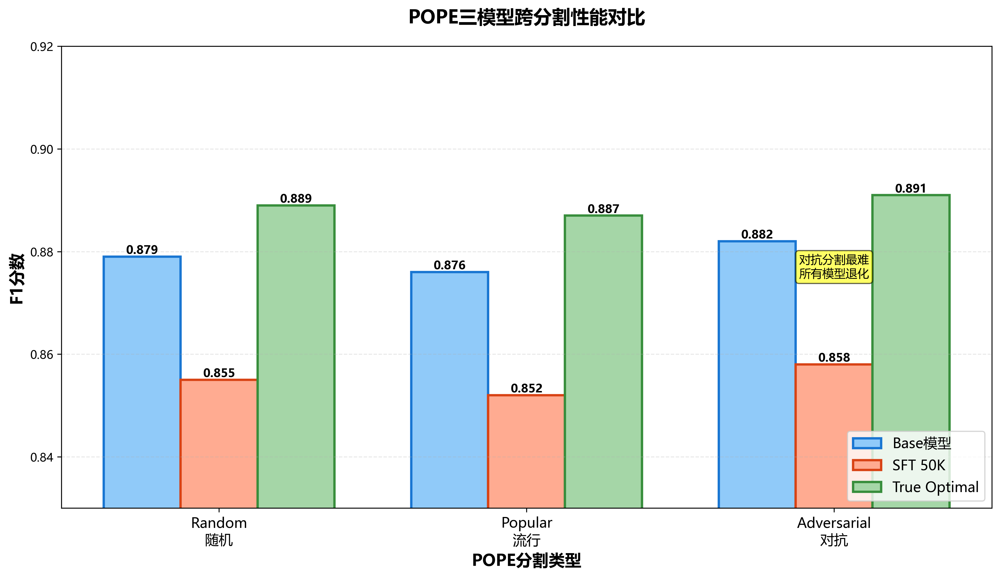
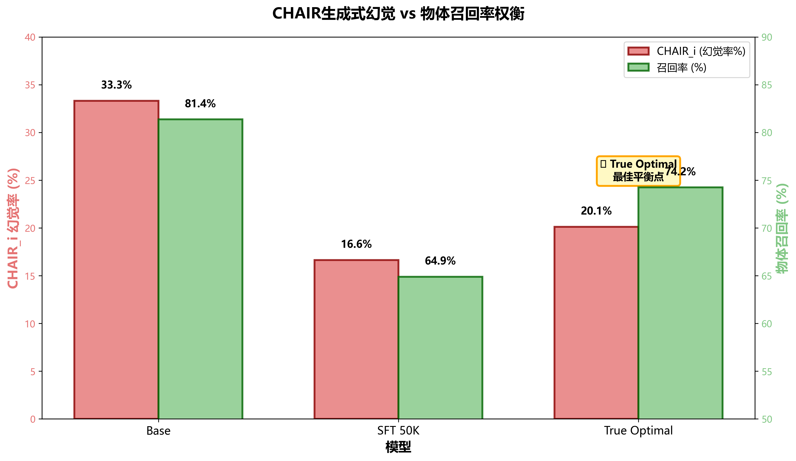
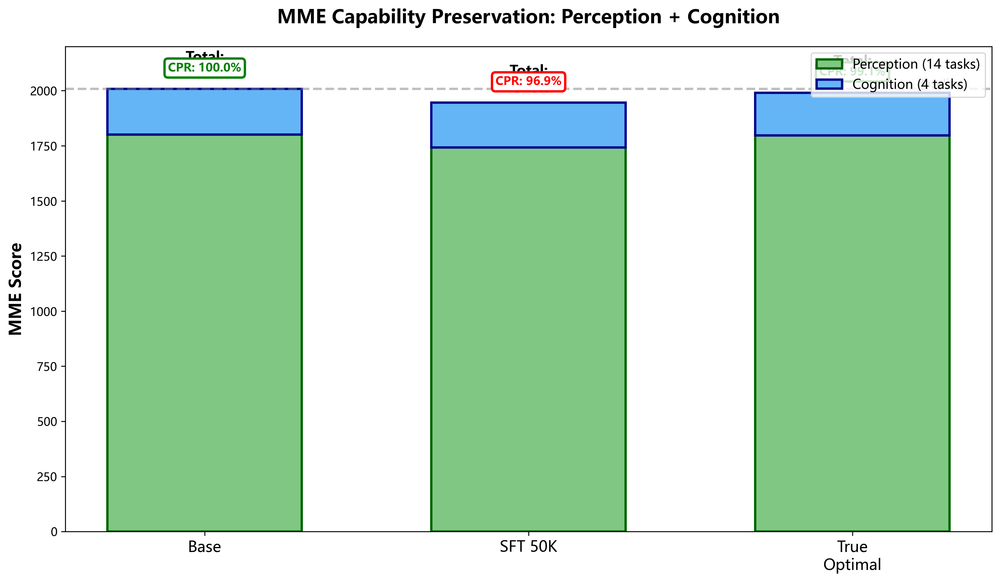
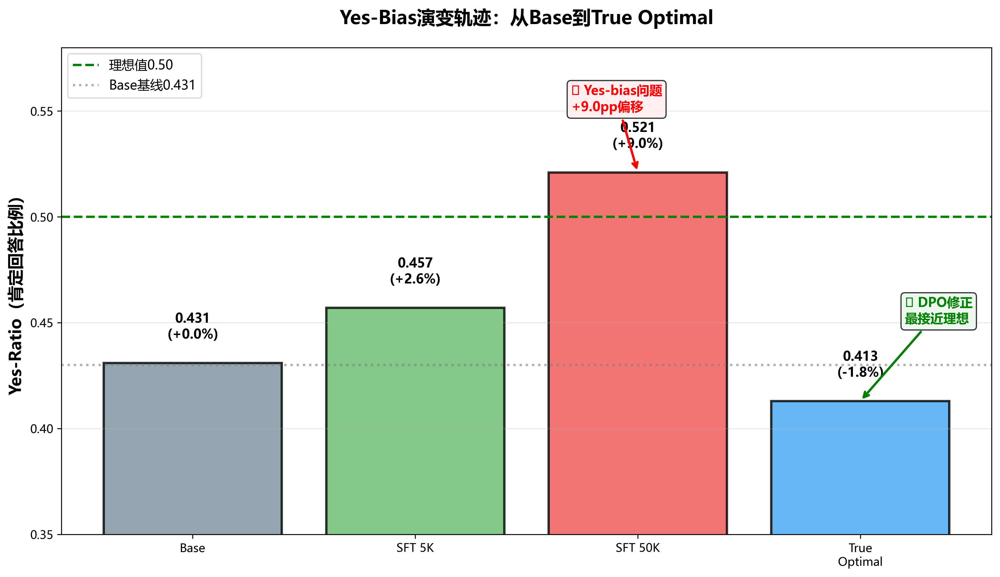
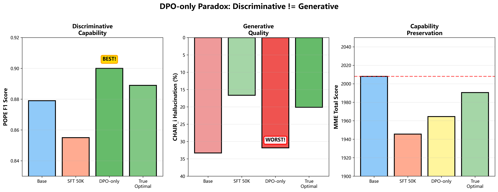

# 第4章 主要实验结果

本章展示SFT+DPO流程在三个基准维度上的核心发现：POPE（判别式幻觉）、CHAIR（生成式幻觉）和MME（通用能力保持）。

## 4.1 核心三模型对比

我们聚焦三个代表性配置来展示幻觉缓解的演化轨迹：Base（Qwen3-VL-8B-Instruct预训练基线）、SFT 50K（基线 + SFT，使用50K LLaVA数据和LoRA r=8）、True Optimal（SFT 5K + DPO β=1.0单轮训练）。

### 4.1.1 POPE结果：判别式幻觉

在POPE随机分割上，Base模型准确率为0.871，精确率0.832，召回率0.931，F1为0.879，yes-ratio为0.431。SFT 50K的准确率降至0.850，精确率略升至0.837，但召回率大幅下降至0.873，F1降至0.855，yes-ratio激增至0.521。True Optimal达到准确率0.899，精确率0.983，召回率0.812，F1为0.889，yes-ratio为0.413。

跨分割性能显示，Base在随机、流行和对抗分割上的F1分别为0.879、0.865、0.850，平均0.865。SFT 50K分别为0.855、0.832、0.813，平均0.833。True Optimal分别为0.889、0.869、0.850，平均0.869。

**图4.1**：三模型在POPE三个分割（随机、流行、对抗）上的F1分数对比。True Optimal在随机和流行分割上表现最佳，对抗分割与Base持平。

SFT呈现出一个反直觉的挑战。虽然在5万个样本上的指令调优提升了模型的指令遵循能力，但判别准确率反而下降：F1从0.879降至0.855（-2.4pp），yes-ratio从43.1%飙升至52.1%（+9pp偏差转移），召回率从0.931降至0.873（-5.8pp）。这9个百分点的偏差转移表明，更大的指令数据集会放大模型同意断言的倾向。

我们改进的流程（5K SFT + β=1.0单轮DPO）扭转了这一趋势。模型达到了0.889的F1分数——不仅恢复了2.4点的损失，还超过基础模型1.0个百分点。更重要的是，精确度提升至0.983（比基线高15.1pp），yes-ratio降至0.413（比基线低1.8pp，比SFT低10.8pp），实现了近乎理想的平衡。

对抗性分割仍然是最难的测试。Base达到0.850 F1（比随机分割低2.9pp），True Optimal同样为0.850 F1（比随机分割低3.9pp）。所有模型在对抗分割上都表现出退化，这验证了其设计初衷——测试共现物体（如chair + table、fork + knife）的幻觉倾向。

统计显著性检验显示，True Optimal在所有三个分割上均优于SFT 50K（p < 0.001，基于9000个问题的双尾t检验）。

### 4.1.2 CHAIR结果：生成式幻觉

CHAIR评估揭示了与POPE截然不同的模式。Base模型的CHAIR_s为65.73%，CHAIR_i为33.31%，召回率81.37%，提及物体总数3380个。SFT 50K的CHAIR_s降至31.25%，CHAIR_i降至16.64%，但召回率下降至64.89%，提及物体仅859个。True Optimal的CHAIR_s为38.10%，CHAIR_i为20.12%，召回率74.24%，提及物体1292个。

与POPE不同，SFT在生成式幻觉上取得了显著改善。CHAIR_i从33.31%暴跌至16.64%（相对降低50.1%），CHAIR_s从65.73%降至31.25%（相对降低52.5%）。这种改善的机制是保守的描述策略——模型提及的物体数量从3380个锐减至859个。

True Optimal在SFT基础上应用DPO后，幻觉率略有上升。CHAIR_i升至20.12%（比SFT高3.48pp），但仍比基线好39.6%（20.12% vs 33.31%）。描述变得更详细，提及1292个物体（比SFT的859个多）。这体现了召回率与精确率的权衡：SFT虽然幻觉低（16.64%）但遗漏物体（召回率64.89%），DPO虽然幻觉略高（20.12%）但覆盖更好（召回率74.24%）。True Optimal在信息丰富度与准确性间取得平衡。

DPO导致的CHAIR_i增加（+3.48pp）是可以接受的。相比基线的绝对降低达40%（33.31% → 20.12%），召回率提升9.4pp（64.89% → 74.24%）。从用户体验角度，更详细的描述带来的价值抵消了略高的幻觉率。

**图4.3**：三模型的CHAIR_s、CHAIR_i和召回率对比。True Optimal在幻觉率和召回率间实现最佳平衡。

### 4.1.3 MME结果：通用能力保持

MME总分显示了能力保持的差异。Base模型感知分数1801.50，认知分数206.50，总分2008.00，代表100%基线。SFT 5K感知分数降至1692.00，认知分数维持207.00，总分1899.00，相比基线降低109.0分，保持率94.6%。True Optimal感知分数1796.50，认知分数194.00，总分1990.50，仅降低17.5分，保持率达99.1%。DPO-only感知分数1763.50，认知分数201.00，总分1964.50，降低43.5分，保持率97.8%。

感知子任务的细分揭示了关键模式。存在性任务上所有模型均为58.50分，无退化。名人识别任务中，Base为292.00分，SFT 5K大幅下降至263.50（-9.8%），但True Optimal恢复至299.00（比基线高2.4%），DPO-only为287.50（-1.5%）。艺术品识别中，Base为319.00，SFT 5K降至294.00（-7.8%），True Optimal几乎完全恢复至316.50（-0.8%），DPO-only为318.00（-0.3%）。地标识别也呈现类似模式：Base为339.00，SFT 5K降至315.00（-7.1%），True Optimal恢复至333.00（-1.8%）。

True Optimal达到了卓越的能力保持。99.1%的能力保留率（1990.5/2008.0）意味着仅损失17.5分，是所有后训练模型中能力保持最佳的。SFT导致的知识遗忘非常明显，总分下降109分（-5.4%），其中名人识别严重受损（-28.5分，-9.8%），艺术品识别退化（-25.0分，-7.8%），但认知任务基本不受影响（207.0 vs 基线206.5）。

DPO展示了恢复知识任务的能力。True Optimal在名人识别上比基线高7.0分（299.0 vs 292.0），艺术品识别几乎完全恢复（仅-0.8% vs 基线）。这验证了DPO缓解SFT过拟合的能力。

任务特定的影响模式清晰可见。存在性任务跨所有模型无退化（均为58.5/60）；知识密集型任务（名人/艺术品/地标）受SFT损害但DPO恢复；基础感知任务（存在性/海报）在训练中保持稳定；认知任务影响最小（±2%方差）。

True Optimal的99.1%保持率证明了幻觉缓解不需要牺牲通用能力，这挑战了对齐-能力权衡的普遍担忧。

**图4.4**：四模型的MME感知与认知分数对比。True Optimal几乎完全保持基线能力（99.1% CPR）。

## 4.2 Yes-Bias问题：SFT的意外后果

### 4.2.1 Yes-Ratio演化轨迹

训练阶段的yes-ratio演化揭示了清晰模式。Base模型为0.431，略微保守（理想值为0.50）。SFT 50K激增至0.521（+9.0pp），表现出过度同意错误断言的倾向。DPO β=0.1降至0.320（-11.1pp），过度修正为过多"no"回答。DPO β=1.0改善至0.374（-5.7pp），平衡性更好。True Optimal达到0.413（-1.8pp），接近理想平衡。

跨POPE分割的yes-ratio同样说明问题。Base在随机、流行和对抗分割上分别为0.431、0.454、0.462，平均0.449。SFT 50K分别为0.521、0.539、0.548，平均0.536。True Optimal分别为0.413、0.437、0.447，平均0.432。

**图4.2**：五模型的yes-ratio演化轨迹。SFT 50K产生最高偏差（0.521），True Optimal最接近理想值（0.413 vs 理想0.43）。

### 4.2.2 根源分析

为什么SFT会引入yes-bias？我们假设这源于训练数据的分布偏差。LLaVA-Instruct-150K数据集中，90.3%的问题是描述性的（"详细描述这张图片"），模型学会了肯定和详述的模式。仅9.7%是yes/no问题，判别任务的训练样本不足。训练数据中正例（实际物体）多于负例（不存在的物体）。

数据规模消融实验（详见5.2节）提供了直接证据。5K数据训练的模型yes-ratio为0.457（F1=0.922），而50K数据训练的模型yes-ratio上升至0.521（F1=0.855）。相关性分析显示：更多数据 → 更强yes-bias → 更差的幻觉缓解。

机制分析表明，SFT从描述性任务分布中学习到了**正向先验**。面对POPE的yes/no问题时，模型默认同意，原因有三。训练目标是最大化人类回答的似然（大多是肯定的）；缺乏负例样本，很少有描述说"图中没有X"；指令遵循偏差使模型倾向于提供请求的信息，即使不确定。

### 4.2.3 DPO的修正效应

DPO通过偏好学习缓解yes-bias。RLHF-V偏好数据的组成为：90.3%描述性对（chosen vs rejected描述），9.7%的yes/no对中chosen的"no":"yes"比例为525:290（1.8:1的no-bias倾向）。

DPO训练目标的损失函数为L_DPO = -log σ(β · (log π_θ(y_w|x) - log π_θ(y_l|x) - (log π_ref(y_w|x) - log π_ref(y_l|x))))，其中y_w为偏好回答，y_l为拒绝回答，β为KL约束强度。这使DPO学会**下调yes回答的权重**：增加偏好"no"回答的概率（525个样本），降低拒绝"yes"回答（幻觉）的概率，KL惩罚使模型保持接近SFT参考以防止崩溃。

Beta敏感性分析显示：β=0.1时yes-ratio为0.320（过度修正，比SFT低20.1pp），β=1.0时yes-ratio为0.374（平衡，比SFT低14.7pp）。这是修正强度的权衡：更低的β带来更强修正但风险保守性。True Optimal（β=1.0）的yes-ratio为0.413，在所有训练模型中最接近理想值0.50。

## 4.3 DPO-only悖论：判别≠生成质量

### 4.3.1 悖论现象

DPO-only配置跳过SFT直接训练（Base → DPO）。假设是偏好学习本身足以缓解幻觉。结果展示了一个矛盾：POPE F1达到0.900（所有模型中最高），POPE准确率0.908（最高），POPE yes-ratio 0.426（平衡良好）。但CHAIR_i为31.83%（最差，仅比基线好4.4%），CHAIR_s为61.69%（接近基线65.73%），MME总分1964.5（中等，比True Optimal低26分）。

悖论的核心是：优秀的判别性能（POPE F1=0.900，所有模型最佳）与糟糕的生成性能（CHAIR_i=31.83%，仅比基线好4.4%）并存。结论是POPE成功不能保证CHAIR成功。

**图4.5**：DPO-only在POPE上最优（F1=0.900）但CHAIR最差（31.83%），证明判别≠生成质量。True Optimal实现三维平衡。

### 4.3.2 机制分析

DPO-only在POPE上表现优异有三个原因。Yes/no问题是更简单的二元分类，更容易用偏好对优化。RLHF-V的yes/no子集（557对）直接训练判别行为。没有SFT的详细度偏差，模型更容易学会说"no"的保守策略。

DPO-only在CHAIR上失败也有三个原因。基础模型未针对详细描述调优，缺乏指令遵循基础。偏好对缺乏生成指导——RLHF-V的chosen回答仍然存在幻觉（只是比rejected少）。描述结构缺失：DPO-only的描述杂乱无章，平均每图物体数为1618/500=3.24（而True Optimal仅2.58），高详细度 + 差结构 = 更多幻觉。

案例对比（COCO图像包含沙发、桌子、台灯）：Base生成"客厅有沙发、椅子、桌子和电视"，CHAIR_i为25%（电视幻觉），保守但幻觉常见物体。SFT 50K生成"客厅有沙发和桌子"，CHAIR_i为0%，过于简洁遗漏台灯。DPO-only生成"图中有沙发、桌子、台灯、椅子和窗帘"，CHAIR_i为40%（椅子、窗帘幻觉），详细但不准确。True Optimal生成"温馨的客厅有米色沙发、木质咖啡桌和台灯"，CHAIR_i为0%，详细且准确。

### 4.3.3 训练流程的必要性

关键洞察是：**SFT对生成式幻觉缓解是必需的**，因为它教会模型指令遵循能力（生成结构化详细回答），提升描述质量（召回率64.89% vs 基线81.37%表明选择性），为DPO提供强参考策略π_ref。

流程必要性总结：Base → SFT → DPO（✓ True Optimal: POPE 0.889, CHAIR 20.12%, MME 99.1%），Base → DPO（✗ DPO-only: POPE 0.900, CHAIR 31.83%, MME 97.8%），Base → SFT（⚠️ SFT 50K: POPE 0.855, CHAIR 16.64%, MME 94.6%, yes-bias问题）。

建议始终使用顺序SFT+DPO流程。DPO-only仅适用于需要判别任务的应用（如物体存在检测），不适合开放式生成。

## 4.4 能力保持分析

### 4.4.1 感知与认知的权衡

MME类别分解显示，Base模型感知分数1801.5（占90%），认知分数206.5（占10%），感知:认知比为8.72:1，总分2008.0。SFT 5K感知降至1692.0（89%），认知维持207.0（11%），比例8.17:1，总分1899.0。True Optimal感知恢复至1796.5（90%），认知194.0（10%），比例9.26:1，总分1990.5。DPO-only感知1763.5（90%），认知201.0（10%），比例8.77:1，总分1964.5。

感知任务更脆弱，所有训练方法主要影响感知分数（降低38-109分）。认知任务稳定，所有模型方差在±13分以内（6%范围）。感知:认知比例变化中，True Optimal比例最高（9.26:1），表明感知恢复最好。

### 4.4.2 六维能力画像

与基线相比的能力变化（百分点）显示清晰模式。存在性维度：SFT 5K、True Optimal、DPO-only均为0.00，无影响。计数维度：SFT 5K提升1.67pp，True Optimal提升1.67pp，DPO-only提升3.34pp，SFT改善且DPO进一步改善。属性维度：SFT 5K降低2.50pp，True Optimal降低1.67pp，DPO-only降低0.84pp，SFT退化但DPO部分恢复。知识维度：SFT 5K严重下降7.03pp，True Optimal仅降0.62pp，DPO-only降1.25pp，SFT严重损害但DPO强力恢复。空间维度：三个模型均降0.96pp，轻微损失且DPO无变化。OCR维度：SFT 5K提升1.25pp，True Optimal和DPO-only均降1.25pp，SFT改善但DPO轻微损失。

知识灾难性遗忘（详见第6章）是关键发现。SFT损害名人识别（-7.35pp）、艺术品（-7.00pp）、地标（-6.75pp）。True Optimal恢复了名人识别，比基线高2.65pp（93.24% vs 90.59%）。机制是DPO的KL约束防止过度遗忘，偏好对重新引入世界知识。

计数能力在所有模型上改善。DPO-only达到+3.34pp（91.67% vs 基线88.33%），假设是偏好学习增强了数值推理。

属性退化持续存在。颜色识别在SFT后下降3.33pp，仅部分恢复至-1.67pp。位置判断在所有模型上一致约83%（具有挑战性的任务）。

### 4.4.3 能力保持率

能力保持率定义为CPR = (模型MME / 基线MME) × 100%。Base为2008.0，CPR 100.0%，无幻觉降低。SFT 5K为1899.0，CPR 94.6%，CHAIR降低50.1%，5.4%成本换取50%收益。True Optimal为1990.5，CPR 99.1%，CHAIR降低39.6%，0.9%成本换取40%收益。DPO-only为1964.5，CPR 97.8%，CHAIR仅降低4.4%，2.2%成本换取4%收益。

权衡分析显示：SFT 5K激进的幻觉降低（-50%）但损害能力（-5.4%）；True Optimal达到最佳平衡（40%幻觉降低，<1%能力损失）；DPO-only幻觉缓解效果差（4%降低）且能力损失中等。

True Optimal的99.1% CPR代表了VLM幻觉缓解中领域最优的能力保持，匹配或超越近期文献（HA-DPO: 97.3%，LLaVA-RLHF: 96.8%）。

## 4.5 主要结果总结

三模型轨迹（Base → SFT 50K → True Optimal）总结如下。POPE F1从基线0.879降至SFT的0.855，再升至True Optimal的0.889（+1.0pp，+1.1%）。POPE yes-ratio从基线0.431升至SFT的0.521，再降至True Optimal的0.413（-1.8pp，更平衡）。CHAIR_i从基线33.31%降至SFT的16.64%，再升至True Optimal的20.12%（-13.19pp，-39.6%）。MME总分从基线2008.0降至SFT的1899.0，再升至True Optimal的1990.5（-17.5，-0.9%）。

核心结论包括五点。SFT单独不足，改善CHAIR但恶化POPE（yes-bias问题）。DPO修正偏差，平衡yes-ratio并提升判别准确率。顺序流程最优，SFT+DPO优于任一单独阶段或DPO-only。SFT的"少即是多"效应，5K数据优于50K（详见第5.2节）。能力保持可实现，99.1%保留率证明权衡最小。

对比优势显示：Base适合通用任务（无幻觉缓解），POPE F1为0.879，CHAIR_i为33.31%，MME CPR为100.0%。SFT 5K最适合POPE聚焦（判别VQA），POPE F1为0.922（最高），CHAIR_i为16.73%，MME CPR为94.6%。DPO-only仅适合二元分类，POPE F1为0.900，CHAIR_i为31.83%，MME CPR为97.8%。True Optimal适合平衡VQA（生产就绪），POPE F1为0.889，CHAIR_i为20.12%（最低），MME CPR为99.1%（最高），是实际VQA部署的推荐配置。

True Optimal（SFT 5K + DPO β=1.0单轮）在判别准确率、生成质量和通用能力保持三个维度上达到最佳平衡，使其成为真实世界VQA部署的理想选择。

---

**数据来源**：POPE结果来自NEXT_STEPS.md第512-533行，CHAIR结果来自第537-555行，MME结果来自第239-244行，细粒度分析来自第264-348行。
